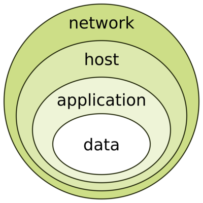
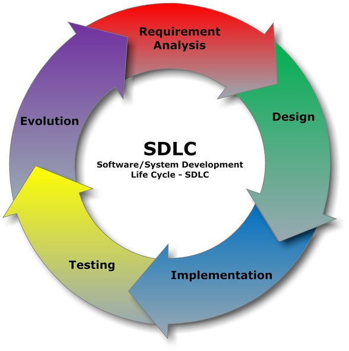
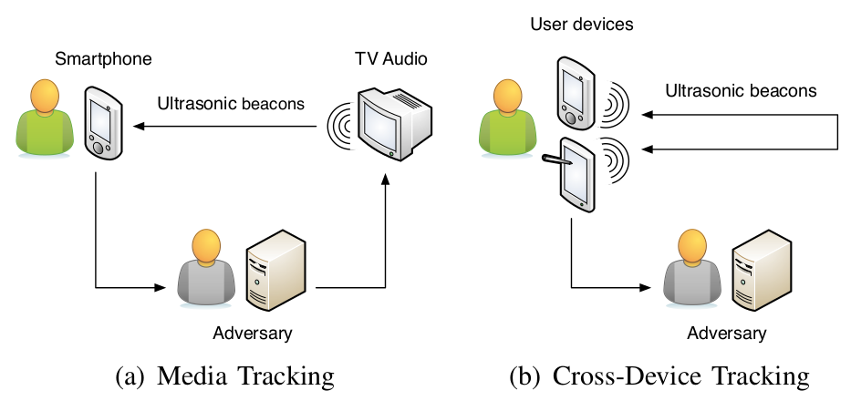
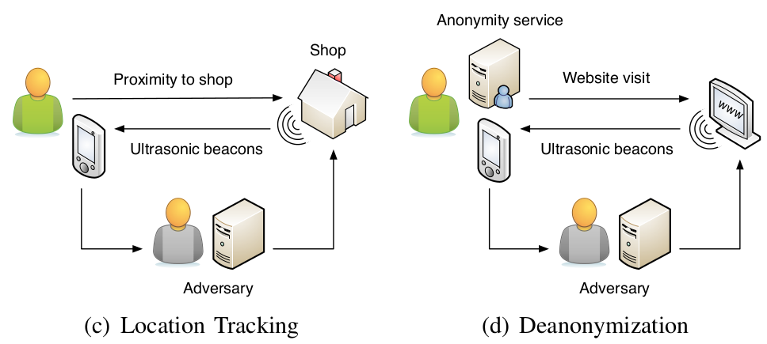

## Agenda

- Sesión 1:
    - Historia
	- Conceptos
    - Riesgos

- Sesión 2:
    - Seguridad como fundamento
    - Ejemplos
    - Conclusiones

# Historia {data-background="img/history-bg.jpg"}

## Pre-computadoras

- Los griegos usaban lo que ahora denominamos *esteganografía*. También emplearon *scytale* para encubrir/cifrar información
- En Roma se utilizaron cifrados de transposición (ej.: cifrado Cesáreo -- ROT13)
- Por siglos se emplearon alfabetos ad-hoc para preservar y ocultar
  información secreta

## Inicios de la computación

- Enigma y el GC&CS en Bletchey Park (Government Code & Cypher School)
- Evolucionó con el uso de Mainframes, creándose grupos especializados
  en cifrar información y romper cifrados de otros.
- Controles físicos para limitar el acceso a las computadoras, y defenderlas
  contra robos, sabotaje, espionaje, etc.

## En los 60s

- Con el inicio de las interconexiones, ARPA comienza a examinar la
  posibilidad de tener comunicaciones interconectadas redundantes.
- Se crea ARPANET, de donde luego se originaría la Internet que ahora conocemos.

## En los 70s y 80s

- ARPANET se volvió popular, pero no tenía:
	- Mecanismos se seguridad para las conexiones (via modem)
	- Métodos de identificación y autorización de usuarios
- Al final de los 70s y los 80s, el potencial problema de seguridad
  aumenta con la aparición de los microprocesadores
- Aparece el "Gusano de Morris" (también llamado el "Gusano de Internet") en 1988

## Rand Report R-609

- Considerado el artículo que inició el estudio de seguridad en computación
- El alcance creció para abarcar mas allá de las seguridad física, e incluir:
	- Salvaguarda de los datos
	- Limitar acceso no autorizado
	- Consideración de una jerarquía de múltiples niveles de acceso
	  dentro de una organización

## Los 90s

- Las redes de computadoras se convierten en algo mas común
- La Internet como un red global de redes
- Seguridad era considerada, aún, una característica de baja prioridad

## Hoy

- El acceso a internet abarca también equipos móviles, IoTs, robots,
  etc.
- Aún se tienen millones de equipos y servicios inseguros
- Asegurar una computadora es un problema exponencial, si se toma en cuenta
  todos aquellos equipos y servicios con los cuales puede estar en contacto
  permanente o transitorio

# Conceptos {data-background="img/conceptos-bg.jpg"}

## Seguridad

- Es la cualidad o estado de estar seguro, de estar libre de peligro
- En informática se consideran varios aspectos/capas:
	- Seguridad física
	- Seguridad del personal
	- Seguridad de las operaciones
	- Seguridad de las comunicaciones
	- Seguridad de las redes de interconexión
	- Seguridad de la información

## Información

- Comprende a los significados e interpretaciones que se hacen sobre los
hechos o datos.
- El valor de la información radica en las múltiples formas como esta se puede
aplicar a una variedad de productos, servicios, etc.
- Es un activo crítico y como tal debe de ser protegido contra riesgos
- Características que afectan al valor de la información: escasez de la misma, y facilidad para compartirla

## ¿Qué es seguridad de la información? (InfoSec)

¿Qué es? (ISO/IEC 27000:2009)
: "... la preservación de confidencialidad, integridad y disponibilidad de la información. ..."

- La teoría, procedimientos y práctica cuyo objetivo es el prevenir el acceso,
  uso, divulgación, disrupción, modificación, inspección, registro o
  destrucción no autorizada de información.

## Bases de seguridad de la información

"*InfoSec triad*"

- Confidencialidad
- Integridad
- Disponibilidad

## Confidencialidad

¿Qué es?
: La propiedad por la cual la información no está disponible o no se comunica a individuos, entidades o procesos no autorizados.

- *Ejemplo de pérdida de confidencialidad*: cuentas de usuarios incluyendo tarjetas de crédito que son expuestas por una brecha de seguridad en una tienda en línea.

## Integridad

¿Qué es?
: Implica el mantener y asegurar la exactitud y el estado de completitud de los
	datos, sobre todo su ciclo de vida, de manera que estos no pueden ser
	modificados en una forma no autorizada o indetectable.

- *Ejemplo de pérdida de integridad*: comunicación entre un usuario y su banco es interceptada, y la cuenta de destino de una transferencia es modificada sin que el usuario lo perciba.

## Disponibilidad

¿Qué es?
: La condición de que la información esté accesible cuando sea necesario para cumplir su propósito. Implica que los sistemas de almacenamiento, procesamiento y de comunicación de la información funcionan correctamente.

- *Ejemplo de pérdida de disponibilidad*: cuando se "cayó" el servicio de WhatsApp hace unos días `:-)`

## Confianza en InfoSec

Autenticación
: Asegurarse que eres quien dices ser

Autorización
: Que puedes hacer, y bajo que condiciones

No repudiación
: El no poder negar que hiciste algo

## Sistema de Información

- Un Sistema de Información es el conjunto de hardware, software, datos,
  personas, procedimientos, y redes de comunicación, que se necesitan
  para que usar información como un recurso en una organización.

## Niveles de acción de InfoSec

- Físico
	- Infraestructura y equipos
- Individual
	- Afecta a las personas y sus interacciones
- Organizacional
	- Políticas globales dentro de la organización
	- Coordinación entre las diversas entidades internas y externas

# Riesgos, amenazas y conceptos relacionados {data-background="img/riesgos-bg.jpg"}

## Riesgos

- Ocurren debido a la existencia potencial de una, o mas, debilidades que pueden ser empleadas para hacer peligrar a la información (*vulnerabilidad*).
- El actor en un riesgo es la *amenaza*: cualquier cosa (hecha por el hombre, o acción de la naturaleza) que tiene el potencial de causar daño a los activos.
- La probabilidad de que una *amenaza* pueda usar una *vulnerabilidad* para hacer peligrar a la información, genera un *riesgo*.
- Un *incidente*, es un caso específico de explotación del riesgo.

## Manejo de riesgos

- Proceso de identificar los activos de información, sus valores intrínsecos para la institución, sus riesgos potenciales, y decidir como actuar al respecto.
- Usualmente es fácil identificar los activos críticos, pero casi imposible el identificar todos los activos de información existentes, incluyendo los "legacy".
- Además, en la práctica no se pueden identificar todos los riesgos posibles, ni todas las posibles pérdidas debido a los que si se han identificado. Siempre hay un *riesgo residual*.
- Es como hacer malabares con sierras eléctricas, de noche, con los ojos vendados y saltando en un pie.

## Opciones para el manejo de riesgo

- Se **acepta el riesgo**, basándose en el relativo bajo valor del activo, la relativa baja frecuencia de incidentes, y/o el posible bajo impacto de un ataque sobre la organización
- Se **mitiga el riesgo**, seleccionando e implementando medidas apropiadas de control para reducir las superficie expuesta de ataque, asi como sus consecuencias

## Opciones para el manejo de riesgo
- Se **transfiere el riesgo**, a otra entidad al comprar un seguro contra intrusiones, o se puede hacer outsourcing del proceso completamente
- La factibilidad y realidad de un riesgo puede estar en disputa, en esos casos se puede optar por **rechazar o negar** la posibilidad del mismo (no es lo mas recomendable)

## Asegurando los componentes

- Una computadora puede ser el sujeto de un ataque y/o el objeto del ataque
	- Como sujeto: es la herramienta usada activamente para efectuar el ataque
	- Como objeto: es la entidad que está siendo atacada
- Esto es extensible a cualquier equipo computacional accesible de una u otra forma

## Balance entre seguridad y acceso

- La seguridad perfecta y absoluta no existe -- es un proceso continuo
- Es un equilibrio entre la protección de la información y la disponibilidad
  de la misma
- Lograr un balance implica que, se deben tener niveles de seguridad que
  permitan un acceso razonable, manteniendo la protección contra amenazas
  internas y externas

## Controles de seguridad: Administrativos

- Relacionado a los procedimientos, políticas, estándares y directivas de seguridad.
- Incluye reglamentaciones internas a una organización, legislación general y
  específica del gobierno, estándares internacionales, y buenas prácticas.
- Forman la base para la implementación de los controles lógicos y físicos.

## Controles de seguridad: Lógicos

- Conocidos también como controles técnicos
- Usan software y datos para supervisar y controlar el acceso a la
  información, asi como a los sistemas de computación.
- Se implementan en forma de claves de acceso, firewalls, sistemas
  de detección de intrusiones, listas de control de acceso, controles de
  cifrado de datos, etc.
- Concepto clave: el *principio del menor privilegio* -- dar sólo el nivel
  de acceso suficiente para ejecutar la acción.

## Controles de seguridad: Físicos

- Supervisión y control del ambiente de trabajo y de las instalaciones de
  de cómputo, incluyendo el acceso directo a las mismas
- Se consideran dentro de estos controles: puertas, cerraduras,
  aire acondicionado, alarmas, sistemas de supresión
  de incendios, cameras de vigilancia, barreras físicas, 
  separación de zonas de trabajo y de cómputo, etc.
- Concepto clave: la *separación de deberes* -- una sola persona no debe de
  poder completar todos los aspectos de una tarea crítica.

## Defensa en profundidad

## Clasificación de la información

- En el sector privado se clasifica como: Pública, Sensible, Privada y Confidencial
- En el sector público se usa: Sin clasificación, No oficial, Protegida/Reservada, Confidencial, Secreta, Secreto Máximo
- En algunos casos se usa un "Protocolo de semáforo": Blanco, Verde, Amarillo y Rojo
- La asignación de una clasificación puede y debe de ser revisada periódicamente pues las condiciones pueden haber cambiado

# Intermedio {data-background="img/intermedio-bg.jpg"}

# Seguridad como fundamento {data-background="img/seguridad-bg.jpg"}

## Modelo de abajo hacia arriba

- Un esfuerzo desde las bases: los administradores de sistemas intentan
  mejorar la seguridad de los sistemas bajo su responsabilidad
- Ventaja principal: la pericia técnica de los administradores individuales
- Rara vez funciona, pues carece de
	- Participación coordinada de otros actores
	- Soporte organizacional para su continuidad

## Modelo de arriba hacia abajo

- Es iniciada por las jerarquías altas de las administración
	- Se generan políticas, procedimientos y reglamentos
	- Definen objetivos y resultados esperados
	- Determinan la responsabilidad para cada acción requerida
- Para tener éxito, necesita un estrategia formal de desarrollo, también
  conocida como el "ciclo de vida de desarrollo de sistemas"

## Ciclo de vida de un sistema

- Es una metodología formal para resolver problemas en base a una secuencia
  estructurada de procedimientos
- Usando esta metodología se asegura un proceso riguroso, y se evita el
  saltarse pasos
- El objetivo es crear un proceso exhaustivo de seguridad

----

## Requerimientos

- Identificar que problemas se quieren solucionar
- Definir objetivos, restricciones y alcance del sistema
- Análisis costo-beneficio preliminar
- Se determina la factibilidad técnica, económica, y su impacto en el
  quehacer diario de la organización

## Diseño

- Se definen los parámetros físicos y lógicos que serán necesarios
- Tipo y estructura de datos que soporten la funcionalidad esperada
- Se definen niveles y condicione de acceso
- Tecnologías de software, hardware y comunicaciones que se necesitarán
- Integración con otros sistemas pre-existentes

## Implementación

- Se aprovisionan los equipos computacionales necesarios
- Creación y desarrollo del software
- Se van construyendo manuales de usuario, administración, desarrollo/manteninimiento, instalación, etc.

## Pruebas

- Se hacen pruebas funcionales y no funcionales, en forma interna y con los
  usuarios del sistema
- Pruebas de seguridad (ethical hacking)
- Pruebas de carga, escalabilidad y disponibilidad

## Evolución

- Cambios y mejoras en función a las pruebas
- Mantenimiento del sistema y resolución de fallas
- Aparecen nuevos problemas, integraciones o necesidades... y el ciclo continúa

----

## Ethical Hacking

- Actividades para encontrar vulnerabilidades en un sistema, incluyen:
	- Greybox / Blackbox testing ("Pentesting")
	- Side-channel exploitation
	- Escalamiento de privilegios
	- Ingeniería Social (Social Engineering)
- Ejemplo: https://www.youtube.com/watch?v=lc7scxvKQOo

## Criptografía

- Cifrar información para restringir el acceso a terceros
- Esteganografía, scytale, cifrados por transposición, OTPs, etc.
- Cifrado simétrico: la misma "clave" cifra y descifra la información
- Cifrado asimétrico: la clave de cifrado es distinta a la de descifrado, pero
  ambas estan relacionadas por una operación matemática

## Uso de criptografía

- Firma digital de documentos (PKI)
- Cifrado de archivos (AES 256)
- Asegurar intercambio privado de información (HTTPS, SSH, etc.)
- Autenticación con múltiples factores (MFA) 
- Restricción de uso o acceso a medios/software/hardware (DRM)
- Registro auditable y distribuído de transacciones (Blockchain)

# Ejemplos {data-background="img/ejemplos-bg.jpg"}

## Malware

- Software malicioso que trata de interferir en la operación de una
  computadora o equipo móvil, extraer información confidencial, conseguir
  accesos no autorizados, o mostrar avisos no deseados.
- Worms, virus, troyanos, spyware, keyloggers, RATs, etc.
- Algunos contienen multiples "cargas" o componentes, y se esconden de los
  sistemas de detección
- Existen los creados por amateurs, profesionales y naciones
- Algunos convierten a tus equipos en "zombies" o "bots" controlados por terceros

## Caso: El catálogo espía de TAO (NSA)

- Un conjunto de "implantes" de hardware y herramientas de software,
  diseñados para la intervención de comunicaciones, control remoto de equipos,
  y actividades de ciber-vigilancia
- En el 2013, *Der Spiegel* publicó el catálogo clasificado de implantes de
  hardware. Snowden ya había publicado información acerca de herramientas
  de software usadas en NSA.

## Caso: El catálogo espía de TAO (NSA)

- Mas detalles en *Der Spiegel*:
	- [Shopping for Spy Gear -- Catalog Advertises NSA Toolboxi](http://www.spiegel.de/international/world/catalog-reveals-nsa-has-back-doors-for-numerous-devices-a-940994.html)
	- [Documents Reveal Top NSA Hacking Unit](http://www.spiegel.de/international/world/the-nsa-uses-powerful-toolbox-in-effort-to-spy-on-global-networks-a-940969.html)
- [El catálogo](https://leaksource.wordpress.com/2013/12/30/nsas-ant-division-catalog-of-exploits-for-nearly-every-major-software-hardware-firmware/) en Leaksource

## Ransomware

- Un tipo especial de malware que en forma oculta va cifrando (asimétricamente)
  la información en una computadora.
- Luego extorsionan a la víctima, amenazando que si no pagan una cantidad
  determinada toda la información será borrada.
- Es el modo de ataque por malware mas "rentable" (a nivel de usuarios
  individuales) desde el 2015

## Caso: Hospitales atacados por ransomware

- Aproximadamente el 88% de los ataques a instituciones en el 2016 fueron a
  hospitales ([Hospitals are hit with 88% of all ransomware attacks](http://www.beckershospitalreview.com/healthcare-information-technology/hospitals-are-hit-with-88-of-all-ransomware-attacks.html))
- Los hospitales tienden a pagar para no perder la información de sus pacientes,
  y evitar consecuencias graves o fatales para los mismos

## Caso: Hospitales atacados por ransomware

- Son el "objetivo perfecto" para estos ataques, debido a la gran superficie
  de vulnerabilidad que suponen los datos de salud de los pacientes, asi como
  los administrativos.
- Mas detalles en:
	- [Why Hospitals Are the Perfect Targets for Ransomware](https://www.wired.com/2016/03/ransomware-why-hospitals-are-the-perfect-targets/)
	- [Largest NHS trust hit by cyber attack](http://www.telegraph.co.uk/news/2017/01/13/largest-nhs-trust-hit-cyber-attack/)
	- [Ransomware Case Studies: Hollywood Presbyterian And The Ottawa Hospital](http://resources.infosecinstitute.com/category/healthcare-information-security/healthcare-attack-statistics-and-case-studies/ransomware-case-studies-hollywood-presbyterian-and-the-ottawa-hospital/#gref)

## Phishing

- Ataques cuyo objetivo es el conseguir credenciales de acceso para una cuenta
  (generalmente) de correo electrónico o de tarjeta de banco/crédito
- Las cuentas de email son usadas luego en otros ataques, para envío de SPAM,
  distribución de malware, etc.
- Existe una variante llamada "Spear-Phishing" que son ataques selectivos
  y dirigidos a una persona o perfil específico de usuario
- Hace uso de ingeniería social para conseguir sus fines

## Caso: Ataque de Phishing a usuarios de Gmail

- Un malware se hace pasar como un adjunto de Google Docs
- Al ir al enlace, se imita a la interfaz de Google Docs/Drive
- Pide a los usuarios que le de permisos para poder acceder al documento
- Estos permisos permiten al malware tomar control total de la cuenta de correos
- Mas detalles en:
	- [Massive Phishing Attack Targets Gmail Users](http://www.nbcnews.com/tech/security/massive-phishing-attack-targets-millions-gmail-users-n754501) (Noticia del 4 de mayo del 2017)

## Rastreo de usuarios (Privacidad)

- Facebook sabe quienes son tus amigos y parientes
- Google sabe que sitios visitas
- Soundcloud y Spotify saben que música te agrada
- ... y un largo etc.
- Recuerda: **si no pagas por un servicio, tú eres la mercancía**

## Caso: Rastreo usando ultrasonido

<small>

> In summary, an adversary is able to obtain a detailed, comprehensive user
> profile by creating an ultrasonic side channel between the mobile device and
> an audio sender. Our case study on three commercial ultrasonic tracking
> technologies reveals that the outlined tracking mechanisms are not a
> theoretical threat, but actively deployed (e.g. Shopkick and Lisnr) or at
> least in the process of being deployed (e.g. SilverPush).

De: ["Privacy Threats through Ultrasonic Side Channels on Mobile Devices"](http://christian.wressnegger.info/content/projects/sidechannels/2017-eurosp.pdf) (Daniel Arp, Erwin Quiring, Christian Wressnegger & Konrad Rieck)</small>

## Caso: Rastreo usando ultrasonido

## Caso: Rastreo usando ultrasonido

## DDOS

- **D**istributed **D**enial **O**f **S**ervice
- El objetivo es saturar al máximo un recurso para que otros no lo puedan usar
- Los ataques mas recientes se hacen desde botnets alrededor del mundo
- En ocasiones es usado como una distracción de otros ataques mas directos
- Algunos han sobrepasado 1 Tbps (1 Terabit por segundo)

## Caso: Ataque a grupo Pro-Democracia en Hong Kong

- Ocurrió en Noviembre del 2014 y superó los 500 Gbps
- El ataque tenía como objetivo el anular el acceso a PopVote.hk
- Grupo relacionado al movimiento "Occupy Central" de Hong Kong
- Mas información en:
	- [The Largest Cyber Attack In History Has Been Hitting Hong Kong Sites](https://www.forbes.com/sites/parmyolson/2014/11/20/the-largest-cyber-attack-in-history-has-been-hitting-hong-kong-sites/#29fdb79138f6")

## Caso: Ataque a OVH

- Ocurrió en Setiembre del 2016 y superó 1 Tbps
- Fué lanzado desde aprox. 152,000 equipos IoT comprometidos
- La víctima fué una compañía de hosting de sitios web
- El culpable fué una compañía que ofrecía sus "servicios" al mejor postor

## Caso: Ataque DynDNS

- Ocurrió en Octubre del 2016 y también supero 1.2 Tbps
- Se lanzo desde un subconjunto de la botnet Mirai
- Esta botnet tiene un estimado de 500,000 a 550,000 nodos
- Afectó seriamente los servicios de internet a nivel mundial

## Mapas de Amenazas y Ataques {data-background-iframe="https://threatmap.checkpoint.com/"}

- [Checkpoint Live Threat Map](https://threatmap.checkpoint.com/)
- [Cyberthreat Real-Time Map](https://cybermap.kaspersky.com/)
- [FireEye Cyberthreat Map](https://www.fireeye.com/cyber-map/threat-map.html)
- [Norse Attack Map](http://map.norsecorp.com/)
- [Looking Glass Threat Map](https://www.lookingglasscyber.com/resources/threatmap/)
- [Google Digital Attack Map](http://www.digitalattackmap.com/)
- ... etc.

## Algunas estadísticas sobre ataques

- DDOS: de 196 Gbps en 2015 a 1.2 Tbps en 2016 (fuente: [Average DDoS attack size increasing, Arbor warns businesses](http://www.computerweekly.com/news/4500250283/Average-DDoS-attack-size-increasing-Arbor-warns-businesses))
- Algunos ataques duran minutos, otros semanas o meses
- Cibercrimen: de un 67% en 2015 a 72% en 2016 (fuente: [2016 Cyber Attacks Statistics](http://www.hackmageddon.com/2017/01/19/2016-cyber-attacks-statistics/))
- Hacktivism: de ~21% en 2015 a 14% en 2016

# Conclusiones {data-background="img/conclusiones-bg.jpg"}

## Seguridad de la información

- Es un proceso continuo que trata de asegurar que los riesgos y controles
  están balanceados
- Necesariamente es un aspecto crítico en todo Sistema de información
- Se requieren múltiples capas y dimensiones de seguridad: física, individual,
  de operaciones, comunicaciones, redes, información, etc.

## Seguridad de la información

- Se tiene que considerar siempre el balance entre la protección de los
  activos, y la necesidad de acceder a ellos
- El manejo debe ser metódico y programado, no improvisado, con la participación
  de muchos actores en una organización
- Es crítico el educar e informar a las personas, pues son el punto mas
  débil en la mayoría de sistemas de información

