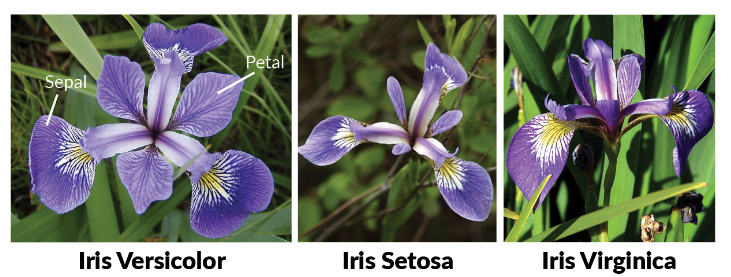

## Agenda

- Big Data
- Data Science
- Machine Learning
    - Clasificación
        - kNN
        - Naive Bayes
        - Árboles de Decisión
- Deep Learning
    - Conceptos
    - Ejemplos
- Visualización

# Big Data {data-background="img/bigdata-bg.jpg"}

## Para que usamos los datos

- Responder una pregunta concreta
- Contar una historia
- Explorar las relaciones entre las cosas
- Descubrir un patrón
- Utilizarlos para tomar una decisión
- Automatizar un proceso
- Validar un experimento, ... etc.

## ¿Que és Big Data?

- Término que engloba a los retos que se enfrentan al intentar manejar, procesar,
  y obtener conclusiones de cantidades ingentes de datos.
- Características a tomar en cuenta:
    - Volúmen (cantidad de datos generados y/o almacenados)
    - Velocidad (con que frecuencia se renuevan/aparecen)
    - Variedad (múltiples fuentes y formatos)
    - Variabilidad (inconstencias o cambios en datos)
    - Veracidad (calidad de los datos)

## Ejemplo de "Big Data"

- Twitter Firehose:
    - Acceso al 100% de los tweets
        - Twitter Streaming API hace muestreo
    - Contenido disponible en tiempo (casi) real
    - Dos proveedores: GNIP y DataSift
    - Aproximadamente 500 millones ($0.5 \times 10^9) de tweets diarios
        - No sólo texto: imágenes, enlaces, tags, etc.

## Ejemplo de "Big Data"

- Google Web index
    - 60 billones ($60 \times 10^{12}$) de páginas web
    - Aproximadamente 100 ($0.1 \times 10^{15}$) Petabytes
    - El volúme es mayor si tomamos en cuenta imágenes, videos,
      audio, etc. que también esta indexado
    - Aproximadamente 1'000,000 de servidores en funcionamiento
    - Gasta USD 5,000 millones cada trimestre sólo en mantener 
      sus datacenters

## Big Data en salud

- Bristol-Myers Squibb:
    - Reducción en tiempos para simulaciones de ensayos clínicos
      en un 98%, incluyendo optimización de dosis, niveles, análisis, 
      de los pacientes.
    - Antes: en promedio unas 60 horas para cada simulación, ahora usan
      la nube (AWS) y se ha reducido a 1.2 horas.
      
## Big Data en recursos humanos

- Xerox:
    - Disminuyó en un 20% la pérdida laboral en sus call centers
    - Análisis de las causas por las cuales los empleados se iban
    - Incluyendo las capacidades y conocimientos
    - Cambió sus forma de contrato y aumento el compromiso de los
      trabajadores

## Big Data en negocios

- IBM y The Weather Company
    - Impacto del clima en los negocios estimado entre USD 0.5 y 1 billón
      ($10^{12}$), sólo en USA.
    - Mas de 100,000 sensores remotos (incluyendo en aviones), asi como
      millones de smarthphones, edificios y vehículos motorizados
    - Se emplean entre 2.2 a 10 mil millones ($10^9$) de datos climatológicos al día
    - Entre los usuarios se encuentran las compañías de seguro

## Big Data en reducción de costos

- Pratt & Whitney
    - Fabricante de motores de aviación, intenta reducir los
      eventos de falla o mantenimiento no planeados.
    - Recaban unos 5,000 parámetros continuamente antes, durante y
      después de un vuelo.
    - Esto genera unos 2 Pb (Petabytes, $10^{12}$ bytes) de 
      datos que tienen que ser analizados

## Tecnologías de soporte

- Almacenamiento de datos (ej. GFS, ZFS, Amazon S3, etc.)
- Proceso de datos (ej. Apache Hadoop, Apache Spark, etc.)
- Análisis de data streams (ej. Apache Kafka, AWS Kinesis, etc.)
- Visualización de datos (ej. D3.js, Plotly, NVD3, etc.)
- Lenguajes de programación/análisis/modelaje (ej. R, Python, Julia, Scala, etc.)

----


## [The Panama Papers](https://www.icij.org/investigations/panama-papers/) {data-background="img/panamapapers-site.png"}


# Data Science {data-background="img/datascience-bg.jpg"}

## ¿Qué es Data Science?

- Un campo interdisciplinario que trata de extraer (usando métodos
  científicos, procesos y sistemas) conocimiento o ideas nuevas de 
  los datos.
- Los datos pueden provenir de múltiples fuentes, con diversos niveles
  de calidad, ser completos o parciales, además de poder estar
  estructurados o no estructurados, entre otras características.

## Requisitos

- Manipulación y limpieza de datos
- Bases de datos estructuradas y no estructuradas
- Estadística y matemáticas
- Machine Learning
- Programación de software
    - Especialmente en lenguajes de análisis de datos (R, Python, etc.)
- Visualización de datos y comunicación

## Data Scientist Road Map

(Fuente: [http://nirvacana.com/thoughts/becoming-a-data-scientist/](http://nirvacana.com/thoughts/becoming-a-data-scientist/))


## [Kaggle](https://www.kaggle.com/) {data-background="img/kaggle-com.png"}


# Machine Learning {data-background="img/machinelearning-bg.png"}


## ¿Qué es Inteligencia Artificial?

- Un término general que se refiere a sistemas computacionales con la
  capacidad de encontrar respuestas a problemas, sin ayuda humana y sin
  tener la solución codificada en software.

## Objetivos de la Inteligencia Artificial

- Razonamiento y resolución de Problemas
- Representación del conocimiento
- Planificación
- Aprendizaje (Machine Learning)
- Procesamiento del lenguaje

## Objetivos de la Inteligencia Artificial

- Percepción
- Movimiento y manipulación
- Inteligencia social
- Creatividad
- Inteligencia general (AI-complete)

## ¿Qué es Machine Learning?

- El campo de estudio interesado en el desarrollo de algoritmos
  computacionales, que permitan la transformación de datos en acciones
  y conocimiento inteligente.
- Se ha desarrollado en un medio en el cual el poder computacional, 
  el volúmen de datos, y los métodos estadísticos han crecido rápida
  y simultáneamente. 


## Tipos de algoritmos

Clasificados en función al "feedback" disponible para el sistema de aprendizaje:

Aprendizaje Supervisado
: Se emplean ejemplos de entradas y salidas deseadas, y se genera un
  modelo general que genera reglas para mapear entradas a salidas
  
Aprendizaje No Supervisado
: No se asignan "etiquetas" a los datos, y el algoritmo genera una
  estructura *de novo* en función a las características de los items.
  El objetivo es el encontrar (posibles) patrones ocultes en los
  datos

Aprendizaje de Reforzamiento
: Un software interactúa con un ambiente dinámico intentanto alcanzar
  un objetivo (ej. manejar un vehículo), y la retroalimentación que
  recibe le permite transitar el espacio de opciones del problema.

## Tareas en ML

Clasificación
: Los datos se tienen que poner en una o mas clases,
  empleando un modelo. Generalmente son algoritmos supervisados.

Regresión
: Cuando las salidas son continuas y no discretas. Se
  emplean algoritmos supervisados.

Agrupamiento
: Intentar agrupar datos en grupos, los cuales no
  son conocidos *a priori*. Se usan algoritmos no supervisados.

## Tareas en ML

Estimación de la densidad
: Trata de encontrar la distribución de los
  datos en un espacio de propiedades determinado.

Reducción de la dimensionalidad
: Intenta simplificar los datos
  mapeándolos a un espacio de menor dimensionalidad. A esto se
  relaciona el problema de "Modelamiento de Tópico", que intenta
  extraer los conceptos claves de documentos para estimar similitudes
  entres los mismos (parte de NLP).

## Clasificación de especies de flores (kNN)

Usaremos el conjunto de datos de lirios de Anderson (y/o Fisher).



## Lirios - Variables

Tiene cinco variables: longitud y ancho del sépalo, longitud y ancho
del pétalo, y la especie asignada.

```{r echo=FALSE, warning=FALSE, message=FALSE}
library(knitr)
library(printr)
library(pander)
library(ggplot2)
library(dplyr)
opts_chunk$set(comment = "", warning = FALSE, message = FALSE)
```
```{r comment=""}
data("iris")
str(iris)
```

## Lirios - Estadísticas

Estadísticas básicas de los datos

```{r results='asis'}
pander(summary(iris))
```

## Lirios - gráfico de sépalos

```{r}
ggplot(iris, aes(x = Sepal.Length, y = Sepal.Width, color = Species)) +
  geom_point() + theme_classic()
```

## Lirios - gráfico de pétalos

```{r}
ggplot(iris, aes(x = Petal.Length, y = Petal.Width, color = Species)) +
  geom_point() + theme_classic()
```


## Lirios - grupo de entrenamiento y de pruebas

```{r}
library(caret)
set.seed(13579)
index <- createDataPartition(iris$Species, p=0.75, list=FALSE)
iris.train <- iris[index,]
head(iris.train, 3)
```

```{r}
iris.test <- iris[-index,]
head(iris.test, 3)
```

## Lirios - el modelo

```{r}
model.knn <- train(iris.train[, 1:4], iris.train[, 5], method = "knn")
predictions <- predict(object = model.knn, iris.test[, 1:4])
print(predictions)
```

## Lirios - Comparación del modelo

```{r}
confusionMatrix(predictions, iris.test[, 5])
```


## [Clasificación de SPAM/HAM (Naive Bayes)](https://castagnetto.site/post/2015-01-03-caret-sms-spamham-classification/) {data-background-iframe="https://castagnetto.site/post/2015-01-03-caret-sms-spamham-classification/"}

## [El Titanic (Decision Trees)](http://hamelg.blogspot.pe/2015/09/introduction-to-r-part-29-decision-trees.html) {data-background-iframe="http://hamelg.blogspot.pe/2015/09/introduction-to-r-part-29-decision-trees.html"}

# Deep Learning {data-background="img/deeplearning-bg.jpg"}

## Redes Neuronales Artificiales

- Sistemas que tratan de emular la forma como funciona el cerebro,
  con una colección de unidades denonimadas neuronas artificiales.
- Las conexiones entre estas unidades llevan señales de fuerza 
  variable, y si la combinación de señales es suficientemente 
  fuerte, la neurona se activa.
- Se entrena al sistema mediante ejemplos, en lugar de emplear un
  algoritmo o solución heurística codificada.
- Muy útil cuando la extracción de características, o la definición
  misma de un problema es difícil de expresar matemática o
  computacionalmente

## Redes Neuronales Artificiales


## ¿Qué es Deep Learning?

- Son algoritmos de ML que:
    - Usan una cascada de muchas capas de procesamiento no-lineal para
      la extracción de características y transformación de datos
    - Usan una organización y estructura de interconexión que hace
      que cada capa reciba la salida de la anterior como entrada.
    - Se basan (usualmente) en el aprendizaje no supervisad de
      múltiples niveles de características o representaciones
      ed los datos.
    - Son capaces de generar múltiples niveles de abstracción,
      los que representan una jeraquía de conceptos.

## [AutoDraw](https://aiexperiments.withgoogle.com/autodraw) {data-background-iframe="https://aiexperiments.withgoogle.com/autodraw"}

## [The Infinite Drum Machine](https://aiexperiments.withgoogle.com/drum-machine) {data-background-iframe="https://aiexperiments.withgoogle.com/drum-machine"}

## [AWS Rekognition](https://aws.amazon.com/rekognition/)


## AWS Rekognition - Escenas


## AWS Rekognition - Rostro


## AWS Rekognition - Comparaciones de rostros


# Visualización {data-background="img/datavisualization-bg.png"}

## [Visualizing Friendships (Facebook, 2010)](https://www.facebook.com/notes/facebook-engineering/visualizing-friendships/469716398919/) {data-background="img/facebook-friendship-map.jpg"}

## [D3.js](https://d3js.org/) {data-background-iframe="https://d3js.org/"}

## [Shiny](https://shiny.rstudio.com/gallery/) {data-background-iframe="https://shiny.rstudio.com/gallery/"}

## [Mi ejemplo de análisis/visualización](https://jmcastagnetto.github.io/coursera-data-products-july2015/#/) {data-background-iframe="https://jmcastagnetto.github.io/coursera-data-products-july2015/#/"}

## [Plotly](https://plot.ly/) {data-background="img/plotly-example.png"}
