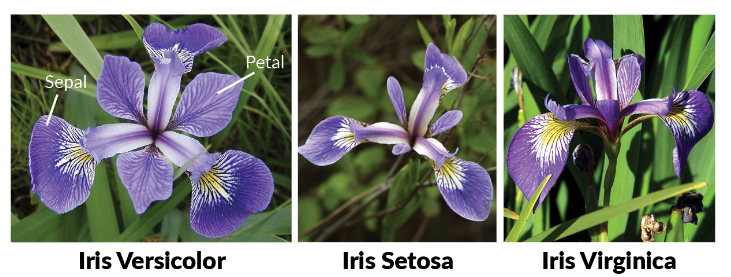
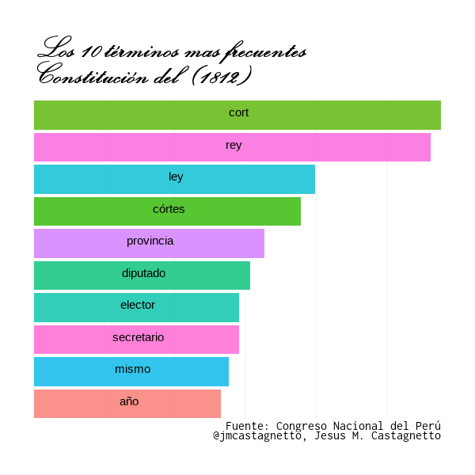

```{r setup, include=FALSE}
options(
  htmltools.dir.version = FALSE
)

knitr::opts_chunk$set(
  echo = FALSE,
  warning = FALSE,
  message = FALSE
)

library(tidyverse)
library(echarts4r)
library(echarts4r.assets)
library(ggpol)
library(ggalluvial)
library(ggforce)
library(showtext)
library(tm)
library(ggwordcloud)
library(randomcoloR)

font_add("Elegante", regular = "elegbold.ttf")
font_add("Inconsolata", regular = "Inconsolata for Powerline.otf")
```

# &nbsp; {data-background-iframe="https://www.r-project.org"}

## **R**

- Inspirado en **S** (John Chambers, Bell Labs, 1978)
- Creado en 1991 por Ross Ihaka y Robert Gentleman (Universidad de Auckland, Nueva Zelandia)
- Software para proceso, análisis, modelado y visualización de datos
- Un lenguaje de programación completo y en continuo crecimiento
- Corre en cualquier plataforma y sistema operativo (incluyendo móviles, consolas de juegos, etc.)
- Es un proyecto de Código Abierto/Libre (FLOSS)
- Una serie de comunidades y proyectos: Bioinformática (Bioconductor), GIS (Rgeo), Finanzas y Economía (Rmetrics), Visualización de datos, etc.

## Uso de **R** en el mundo 

- **Compañías**: Google, Facebook, Microsoft, Twitter, AirBnB, IBM, Uber, AWS, HP, Novartis, Ford, etc.

- **Periodismo**: BBC, Buzzfeed, The Economist, Financial Time, New York Times, etc.

- **Gobiernos**: El Gobierno del Reino Unido, el estado de Indiana, Ciudad de Chicago, etc.

- **Bancos/Finanzas**: HSBC, J.P. Morgan, Morgan Stanley, Citibank, Fidelity, Bank of America, AMEX, etc.

- **Otros**: Gartner, AC Nielsen, Deloitte Consulting, Accenture, PricewaterhouseCoopers, Target, etc.

## Qué ofrece **R**

- Un lenguaje adecuado a los cálculos estadísticos
- Una multitud de librerías que permiten calcular, modelar, etc. y trabajar con datos pequeños o grandes
  - Al 2019/09/23: 14,962 paquetes oficiales
  - En Github: 15,232 repositorios (proyectos) relacionados
- Comunidades:
  - Grupos de usuarios (R-Ladies, Grupos locales)
  - Conferencias (UseR!, EARL, rstudio::conf, etc.)
  - Espacios de interacción y aprendizaje en línea: R for Data Science Community, TidyTuesday, etc.
- Muchísimo material para aprender: Cursos, libros, videos, código, etc.


## Exploración de datos

El ciclo de análisis: importar datos, limpiarlos, transformarlos, visualizarlos, modelarlos, y al final, comunicar los hallazgos


Referencia: ["R for Data Science"](https://r4ds.had.co.nz/explore-intro.html), G. Grolemund y H. Wickham

## Ventajas de usar código para análisis de datos

- Documenta los pasos que se emplearon para obtener los datos.
- Muestra explícitamente como se corrigieron los errores encontrados, que se excluyó, como se normalizó la codificación, etc.
- Explica en forma exacta las transformaciones que se hicieron a los datos.
- Es reproducible a nivel de métodos y resultados, y hasta de inferencias.
- Se puede poner en un sistema de control de versiones, y así ver como evolucionó y se modificó en el tiempo.

# Ejemplos de uso de **R**

## Analizar la distribución de notas de un exámen

- Consideremos las notas de un exámen para un grupo de alumnos.
- Vamos a usar **R** para simular las notas
- Luego calcularemos estadísticas básicas de estos datos
- Después, graficaremos la distribución de las notas
- Finalmente, usaremos operaciones simples en **R** para corregir un error en las notas.

## Simular las notas

```{r echo=TRUE}
# ref: https://stackoverflow.com/questions/19343133/setting-upper-and-lower-limits-in-rnorm
set.seed(2019)
gen_notas <- function(n, avg, sd, min, max, nmuestra) {
  muest <- rnorm(nmuestra, avg, sd)
  muest <- muest[muest >= min & muest <= max]
  if (length(muest) >= n) {
    return(sample(muest, n))
  } else {
    stop(simpleError("No hay datos suficientes. Aumenta 'nmuestra'"))
  }
}
notas <- round(gen_notas(100, 13, 4, 4, 17, 1000), 1)
head(notas, 15)
```
## Calcular estadísticas

```{r echo=TRUE, out.height=450}
mean(notas) # promedio
range(notas) # rango de notas
summary(notas)
```

## Graficar la distribución

```{r echo=TRUE, out.height=450}
hist(notas, breaks = 15, main = "Distribución de notas")
abline(v = mean(notas), col = "blue", lwd = 3)
```

## Las preguntas 14 y 15 eran incorrectas (!!!)

- Les damos 2 puntos a todos y comparamos las estadísticas

```{r echo=TRUE}
notas2 <- notas + 2
summary(notas)
summary(notas2)
```

## 

```{r echo=TRUE, out.height=380}
d <- data.frame(antes = notas, despues = notas2)
ggplot(d) +
  geom_density(aes(x = antes), fill = "red", alpha = 0.8) +
  geom_density(aes(x = despues), fill = "blue", alpha = 0.8) +
  xlim(0, 20)
```

## Agrupación de datos

- Existe un grupo de datos clásico (`iris`) que contiene lirios de tres especies, y datos de longitud y ancho de los pétalos y sépalos.



- Vamos a graficar un par de estos parámetros

## Viendo los lirios

```{r echo=TRUE, out.height=480}
ggplot(iris, aes(x = Sepal.Length, y = Petal.Width, color = Species)) +
  geom_point()
```

## Mejoremos el gráfico

```{r echo=TRUE, eval=FALSE}
ggplot(iris, aes(x = Sepal.Length, y = Petal.Width, color = Species)) +
  geom_mark_hull(aes(label = Species), show.legend = FALSE) + # agrupar
  geom_point(show.legend = FALSE) +
  theme_light() + # un tema mas simple
  labs( # etiquetas del gráfico
    title = "Los tres tipos de lirios",
    x = "Longitud de los sépalos (cm)",
    y = "Ancho de los pétalos (cm)"
  ) +
  theme( # cambiar la fuente del título
    plot.title = element_text(family = "Elegante", size = 24)
  )x
```

##

```{r echo=FALSE, eval=TRUE}
ggplot(iris, aes(x = Sepal.Length, y = Petal.Width, color = Species)) +
  geom_mark_hull(aes(label = Species), show.legend = FALSE) + # agrupar
  geom_point(show.legend = FALSE) +
  theme_light() + # un tema mas simple
  labs( # etiquetas del gráfico
    title = "Las Tres Especies de Lirios",
    x = "Longitud de los sépalos (cm)",
    y = "Ancho de los pétalos (cm)"
  ) +
  theme( # cambiar la fuente del título
    plot.title = element_text(family = "Elegante", size = 18)
  )
```


# Cambios en la composición del Congreso de la República


## Que ha pasado entre el 2016 y el 2019

La composición de los partidos/bancadas en el Congreso de la República ha variado
desde el 2016 a la fecha. 

Intentaremos mostrar este cambio en forma gráfica, usando la información existente en Wikipedia.


## Extrayendo datos de Wikipedia {data-background-iframe="https://es.wikipedia.org/wiki/Periodo_parlamentario_2016-2021_del_Congreso_de_la_Rep%C3%BAblica_del_Per%C3%BA"}

```{r echo=TRUE, eval=FALSE}
library(tidyverse)
library(rvest)

original_xpath <- "/html/body/div[3]/div[3]/div[4]/div/table[3]"
actual_xpath <- "/html/body/div[3]/div[3]/div[4]/div/table[4]"
wiki_url <- "https://es.wikipedia.org/wiki/Periodo_parlamentario_2016-2021_del_Congreso_de_la_Rep%C3%BAblica_del_Per%C3%BA"
c2016 <- read_html(wiki_url)
original_node <- html_node(c2016, xpath = original_xpath)
actual_node <-  html_node(c2016, xpath = actual_xpath)
original_df <- html_table(original_node)
actual_df <- html_table(actual_node, fill = TRUE)
```

## Limpiando los datos

```{r echo=TRUE, eval=FALSE}
# composición original
ultima_fila <- nrow(original_df)
original_df <- original_df[-ultima_fila,]
original_df$agrupacion <- original_df$`Agrupación Política`
original_df$cantidad <- as.numeric(original_df$`N.º`)
original_df <- original_df[,c("agrupacion", "cantidad")]

# composición actual
tmp1 <- toString(actual_node) %>%
  str_replace_all("\\[[^\\]]+\\]", "")
actual_df <- (read_html(tmp1) %>%
                html_table(fill = TRUE, trim = TRUE))[[1]] %>%
  janitor::clean_names() %>%
  select(bancadas, conformacion) %>%
  filter(
    str_detect(bancadas,
               pattern = "^(Bancadas|Total|Fuente|Restricc).*$",
               negate = TRUE)
  ) %>%
  rename(
    agrupacion = bancadas,
    cantidad = conformacion
  ) %>%
  mutate( # el valor tiene caracteres UNICODE, forzar a ASCII
    cantidad = stringi::stri_encode(cantidad, "", "ASCII") %>%
      as.numeric()
  )
```

## Al inicio (2016)
```{r echo=FALSE}
load("data/congreso-2016-2021.Rdata")
```


```{r echo=TRUE, eval=FALSE}
partidos <- original_df$agrupacion
ggplot(original_df2) +
  geom_parliament(aes(seats = cantidad, fill = agrupacion)) +
  scale_fill_manual(values = distinctColorPalette(13), labels = partidos) +
  coord_fixed() +
  labs(
    title = "Congreso 2016-2021", subtitle = "Al inicio",
    caption = "Fuente: Wikipedia"
  ) +
  theme_void() +
  theme(
    legend.position = "right",
    plot.margin = unit(rep(1, 4), "cm"),
    legend.text = element_text(size = 8)
  )
```

## 

```{r echo=FALSE, eval=TRUE}
load("data/congreso-2016-2021.Rdata")
partidos <- original_df2$agrupacion
ggplot(original_df2) +
  geom_parliament(aes(seats = cantidad, fill = agrupacion)) +
  scale_fill_manual(values = distinctColorPalette(13), labels = partidos) +
  coord_fixed() +
  labs(
    title = "Congreso 2016-2021", subtitle = "Al inicio",
    caption = "Fuente: Wikipedia"
  ) +
  theme_void() +
  theme(
    legend.position = "right",
    plot.margin = unit(rep(1, 4), "cm"),
    legend.text = element_text(size = 8)
  )
```

## En la actualidad (2019)

```{r echo=TRUE, eval=FALSE}
partidos <- actual_df$agrupacion
ggplot(actual_df) +
  geom_parliament(aes(seats = cantidad, fill = agrupacion)) +
  scale_fill_manual(values = distinctColorPalette(13), labels = partidos) +
  coord_fixed() +
  labs(
    title = "Congreso 2016-2021",
    subtitle = "En la actualidad",
    caption = "Fuente: Wikipedia"
  ) +
  theme_void() +
  theme(
    legend.position = "left",
    plot.margin = unit(rep(1, 4), "cm"),
    legend.text = element_text(size = 8)
  )
```

## 

```{r echo=FALSE, eval=TRUE}
partidos <- actual_df$agrupacion
ggplot(actual_df) +
  geom_parliament(aes(seats = cantidad, fill = agrupacion)) +
  scale_fill_manual(values = distinctColorPalette(13), labels = partidos) +
  coord_fixed() +
  labs(
    title = "Congreso 2016-2021",
    subtitle = "En la actualidad",
    caption = "Fuente: Wikipedia"
  ) +
  theme_void() +
  theme(
    legend.position = "left",
    plot.margin = unit(rep(1, 4), "cm"),
    legend.text = element_text(size = 8)
  )
```

## Graficando los cambios del 2016 al 2019

```{r echo=FALSE}
df_alluvial <- original_df2 %>%
  full_join(
    actual_df,
    by = "agrupacion"
  ) %>%
  rename(
    "2016" = cantidad.x,
    "2019" = cantidad.y
  ) %>%
  pivot_longer(
    cols = c("2016", "2019"),
    names_to = "periodo",
    values_drop_na = TRUE
  ) %>%
  mutate(
    agrupacion = agrupacion %>%
      str_replace("Partido Aprista Peruano", "PAP") %>% 
      str_replace("Célula Parlamentaria Aprista", "PAP") %>%
      str_replace("Frente Amplio por Justicia, Vida y Libertad", "FA") %>% 
      str_replace("Alianza para el Progreso", "APP") %>% 
      str_replace("Fuerza Popular", "FP") %>% 
      str_replace("Peruanos Por el Kambio", "PPK") %>% 
      str_replace("Acción Popular", "AP") %>% 
      str_replace("Acción Republicana", "Acc.Rep.") %>% 
      str_replace("Bancada Liberal", "Banc.Lib.") %>% 
      str_replace("Frente Amplio", "FA") %>% 
      str_replace("Nuevo Perú", "N.Perú") %>% 
      str_replace("Unidos por la Republica", "Un.Rep.") %>% 
      str_replace("Cambio 21", "C21") %>% 
      str_replace("Contigo", "Cont."),
    label = glue::glue("{grupo} (N={cantidad})",
                       grupo = agrupacion,
                       cantidad = value) %>%
      str_wrap(24)
  )
```

```{r echo=TRUE, eval=FALSE}
ggplot(df_alluvial, aes(x = periodo, y = value, stratum = agrupacion,
               alluvium = agrupacion, fill = agrupacion, label = label)) +
  geom_flow(stat = "alluvium", lode.guidance = "rightleft",
            color = "darkgray") +
  geom_stratum() +
  geom_text(stat = "stratum") +
  scale_fill_manual(values = distinctColorPalette(13), labels = df_alluvial$agrupacion) +
  labs(
    title = "El Congreso 2016-2021",
    subtitle = "Cambios en la composición de fuerzas",
    caption = "Fuente: Wikipedia"
  ) +
  theme_void() +
  theme(
    axis.title = element_blank(),
    axis.text = element_blank(),
    legend.position = "none"
  )
```

## 

```{r echo=FALSE, eval=TRUE, out.width=1200, warning=FALSE}
ggplot(df_alluvial, aes(x = periodo, y = value, stratum = agrupacion,
               alluvium = agrupacion, fill = agrupacion, label = label)) +
  geom_flow(stat = "alluvium", lode.guidance = "rightleft",
            color = "darkgray") +
  geom_stratum() +
  geom_text(stat = "stratum") +
  scale_fill_manual(values = distinctColorPalette(13), labels = df_alluvial$agrupacion) +
  labs(
    title = "El Congreso 2016-2021",
    subtitle = "Cambios en la composición de fuerzas",
    caption = "Fuente: Wikipedia"
  ) +
  theme_void() +
  theme(
    axis.title = element_blank(),
    axis.text = element_blank(),
    legend.position = "none"
  )
```

# Las Constituciones del Perú

## Análisis del texto de las Constituciones

- Obtener los archivos PDF con el texto de las Constituciones (del sitio del Congreso de la República)
- Convertir de PDF a texto (usando `pdftotext`)
- Procesar el texto con **R**
- Graficar un "Nube de palabras" con los términos mas usados
- Crear una animación de los 10 términos mas frecuentes, desde el texto de 1812 al 1993.

## Función para extraer y clasificar los textos

```{r eval=FALSE, echo=TRUE}
crear_txt_df <- function(fname) {
  txt <- readLines(fname, encoding = "utf-8") %>%
    str_replace("Art\\.", "articulo") %>%
    str_replace("art\\.", "artículo")
  docs <- Corpus(VectorSource(txt)) %>%
    tm_map(content_transformer(tolower)) %>%
    tm_map(removeNumbers) %>%
    tm_map(removeWords, stopwords("es")) %>%
    tm_map(removeWords, c("artículo", "art", "articulo", "ser")) %>%
    tm_map(removePunctuation) %>%
    tm_map(stripWhitespace) %>%
    tm_map(stemDocument)
  tdm <- TermDocumentMatrix(docs)
  m <- as.matrix(tdm)
  v <- sort(rowSums(m),decreasing=TRUE)
  tibble(word = names(v),freq=v)
}
```

## Código de la "Nube de Palabras" (1812)

```{r eval=FALSE, echo=TRUE}
load(here::here("data/constitucion_peru_1812_1993.Rdata"))
c_1812 <- constitucion_peru %>%
  filter(yr == 1812) %>% 
  top_n(n = 100, wt = freq)
ggplot(c_1812, aes(label = word, size = freq,
          color = freq, angle = angle)) +
  geom_text_wordcloud_area(rm_outside = TRUE, shape = "square") +
  scale_size_area(max_size = 32) +
  scale_fill_manual(values = randomColor(100, hue = "red")) +
  labs(
    title = "Nubes de palabras de la Constitución del Perú",
    subtitle = "Año: 1812. Fuente: Congreso de la República del Perú.",
    caption = "Tomando los 100 términos mas frecuentes en cada documento\n@jmcastagnetto (Jesus M. Castagnetto)"
  ) +
  theme_minimal()
```

## El gráfico de 1812

```{r eval=TRUE, echo=FALSE}
load(here::here("data/constitucion_peru_1812_1993.Rdata"))
c_1812 <- constitucion_peru %>%
  filter(yr == 1812) %>% 
  top_n(n = 100, wt = freq)
ggplot(c_1812, aes(label = word, size = freq,
          color = freq, angle = angle)) +
  geom_text_wordcloud_area(rm_outside = TRUE, shape = "square") +
  scale_size_area(max_size = 32) +
  scale_fill_manual(values = randomColor(100, hue = "red")) +
  labs(
    title = "Nubes de palabras de la Constitución del Perú",
    subtitle = "Año: 1812. Fuente: Congreso de la República del Perú.",
    caption = "Tomando los 100 términos mas frecuentes en cada documento\n@jmcastagnetto (Jesus M. Castagnetto)"
  ) +
  theme_minimal()
```

## Código de la "Nube de Palabras" (1993)

```{r eval=FALSE, echo=TRUE}
load(here::here("data/constitucion_peru_1812_1993.Rdata"))
c_1993 <- constitucion_peru %>%
  filter(yr == 1993) %>% 
  top_n(n = 100, wt = freq)
ggplot(c_1993, aes(label = word, size = freq,
          color = freq, angle = angle)) +
  geom_text_wordcloud_area(rm_outside = TRUE, shape = "circle") +
  scale_size_area(max_size = 32) +
  scale_fill_manual(values = randomColor(100, hue = "blue")) +
  labs(
    title = "Nubes de palabras de la Constitución del Perú",
    subtitle = "Año: 1993. Fuente: Congreso de la República del Perú.",
    caption = "Tomando los 100 términos mas frecuentes en cada dinstall.packages("randomcoloR")ocumento\n@jmcastagnetto (Jesus M. Castagnetto)"
  ) +
  theme_minimal()
```

## El gráfico de 1993

```{r eval=TRUE, echo=FALSE}
load(here::here("data/constitucion_peru_1812_1993.Rdata"))
c_1993 <- constitucion_peru %>%
  filter(yr == 1993) %>% 
  top_n(n = 100, wt = freq)
ggplot(c_1993, aes(label = word, size = freq,
          color = freq, angle = angle)) +
  geom_text_wordcloud_area(rm_outside = TRUE, shape = "circle") +
  scale_size_area(max_size = 32) +
  scale_fill_manual(values = randomColor(100, hue = "blue")) +
  labs(
    title = "Nubes de palabras de la Constitución del Perú",
    subtitle = "Año: 1993. Fuente: Congreso de la República del Perú.",
    caption = "Tomando los 100 términos mas frecuentes en cada documento\n@jmcastagnetto (Jesus M. Castagnetto)"
  ) +
  theme_minimal()
```

## Animación de términos (1812-1993)



# Graficar los vuelos desde y hacia el Perú

## Usamos datos de OpenFlights.org {data-background-iframe="https://openflights.org/data.html"}

## Proceso de datos

- Se obtuvieron los archivos: 
  - `airlines.dat`: Lista de aerolíneas mundiales
  - `airports.dat`: Lista de aeropuertos, geolocalizados
  - `countries.dat`: Lista de países (con códigos ISO)
  - `routes.dat`: Lista de las rutas (al 2014)
- Usando estos archivos se combinó la información de aeropuertos, países y rutas
- Finalmente, se extrajo sólo aquellos registros de vuelos desde o hacia aeropuertos en Perú.

## Código para la visualización

```{r echo=TRUE, eval=FALSE}
load(here::here("data/peru-flights.Rdata"))
pe_flights %>%
  e_charts() %>%
  e_globe(
    environment = ea_asset("starfield"),
    base_texture = ea_asset("world topo"),
    height_texture = ea_asset("world topo"),
    displacementScale = 0.05
  ) %>%
  e_lines_3d(
    source_lon, source_lat,
    dest_lon, dest_lat,
    source_name = source_name, 
    target_name = dest_name,
    name = "flights", 
    effect = list(show = TRUE)
  ) %>%
  e_legend(FALSE)
```

## Los vuelos desde/hacia Perú en un globo terráqueo

```{r echo=FALSE, eval=TRUE, out.width=900}
load(here::here("data/peru-flights.Rdata"))
pe_flights %>%
  e_charts() %>%
  e_globe(
    environment = ea_asset("starfield"),
    base_texture = ea_asset("world topo"),
    height_texture = ea_asset("world topo"),
    displacementScale = 0.05
  ) %>%
  e_lines_3d(
    source_lon, source_lat,
    dest_lon, dest_lat,
    source_name = source_name, 
    target_name = dest_name,
    name = "flights", 
    effect = list(show = TRUE)
  ) %>%
  e_legend(FALSE)
```


# Material de referencia

## Libros y otros

- ["Education @RStudio"](https://education.rstudio.com/)
- [Data Organization in Spreadsheets](https://amstat.tandfonline.com/doi/full/10.1080/00031305.2017.1375989#.XYlLQOZKiPQ), K. W. Broman y K. H. Woo, *The American Statistician*.
- [Fundamentals of Data Visualization](https://serialmentor.com/dataviz/), C. O. Wilke
- [Data Visualization with R](https://rkabacoff.github.io/datavis/), R. Kabacoff
- [R for Data Science (R4DS)](https://r4ds.had.co.nz), G. Grolemund y H. Wickham
  - [Versión en Español](https://es.r4ds.hadley.nz/)
- [Awesome R](https://awesome-r.com): https://github.com/qinwf
- ["awesome-r @github"](https://github.com/uhub/awesome-r)
- [TidyTuesday](https://github.com/rfordatascience/tidytuesday): Datos y ejemplos de visualizaciones

## Gracias por escucharme 

- URL de esta presentación:
  - https://castagnetto.site/talks/foro/universo-de-r-analisis-visualizacion.html

- Código y datos de esta presentación:
  - https://github.com/jmcastagnetto/jmc_talks/tree/master/20190928-vi-foro-transformacion-estado

- Contacto:
  - Twitter: @jmcastagnetto
  - Email: jesus@castagnetto.com
