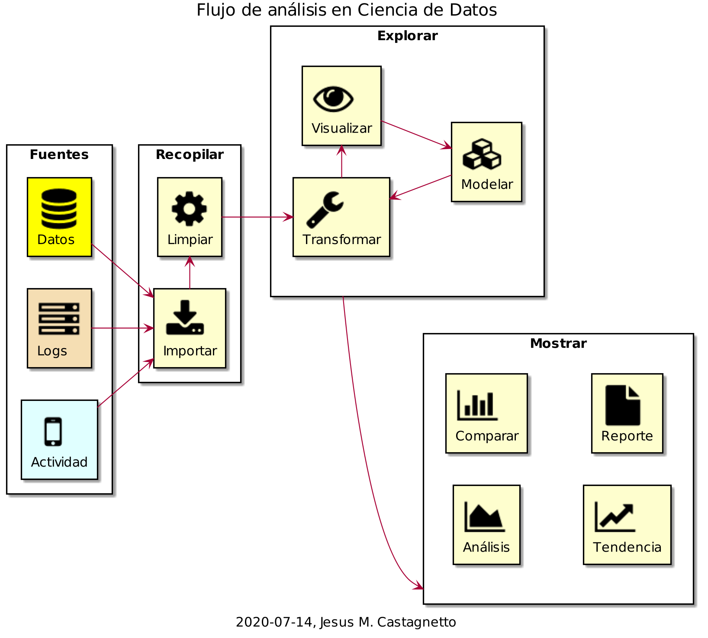
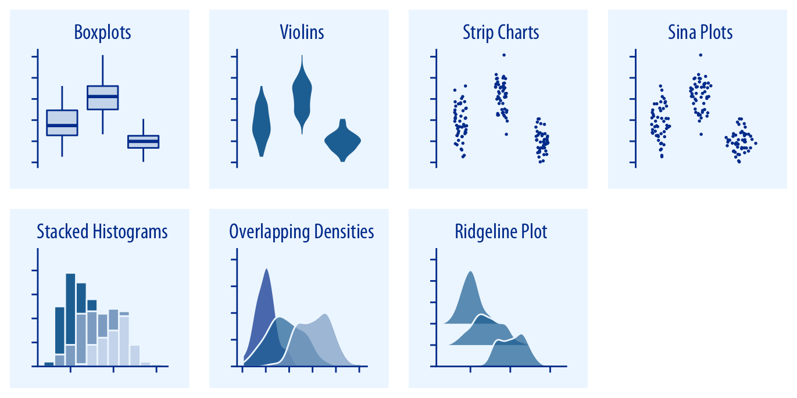
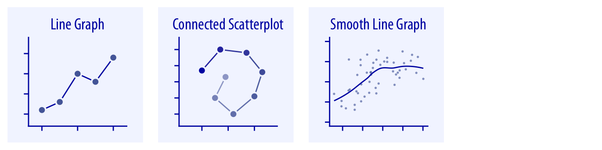
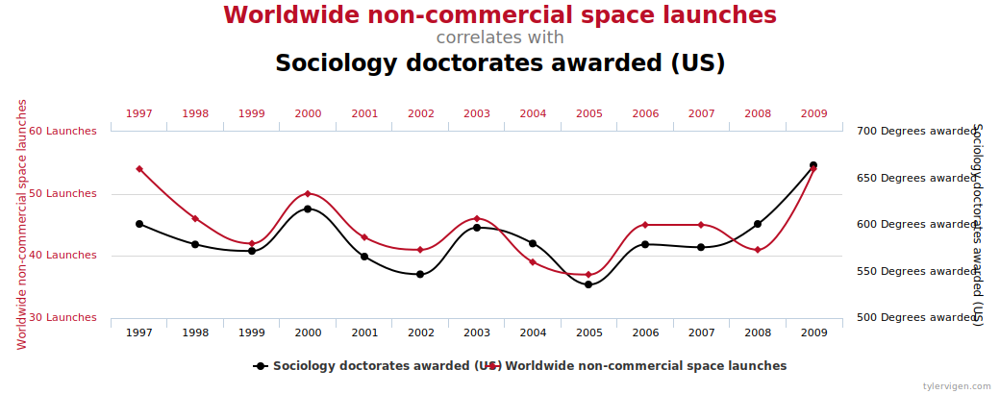
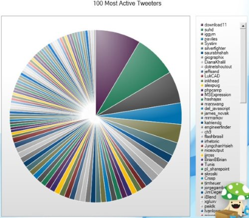
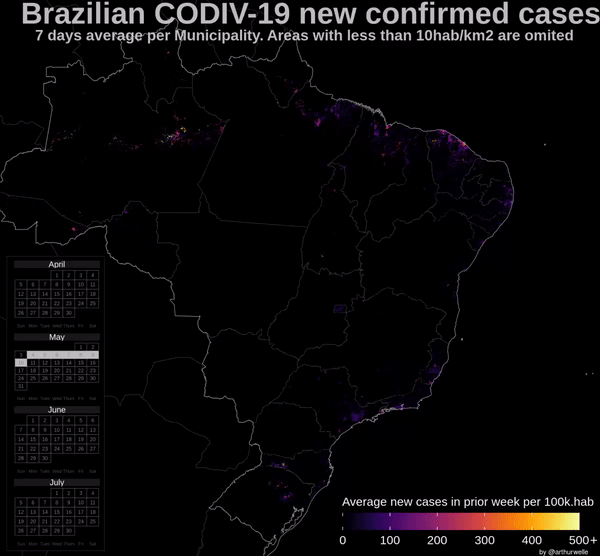
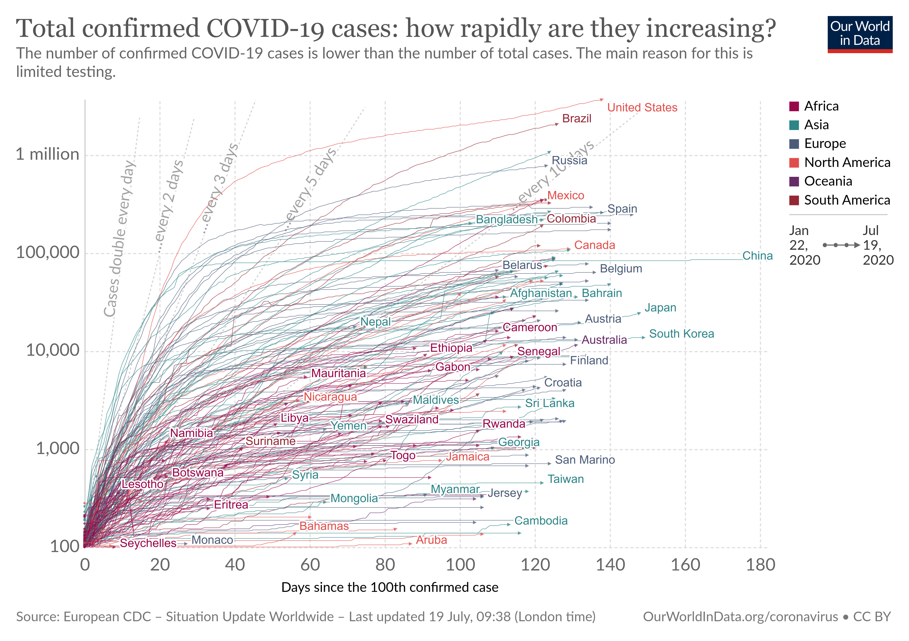
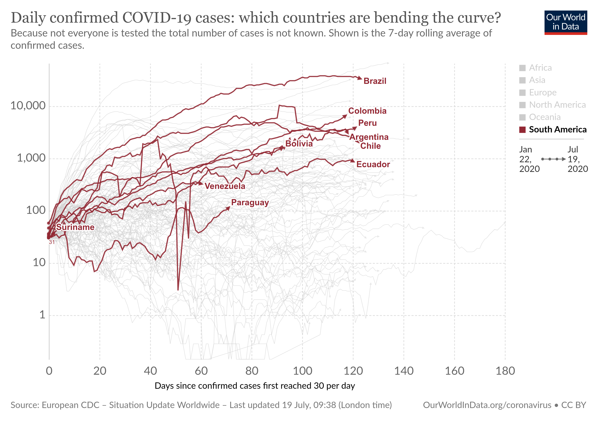
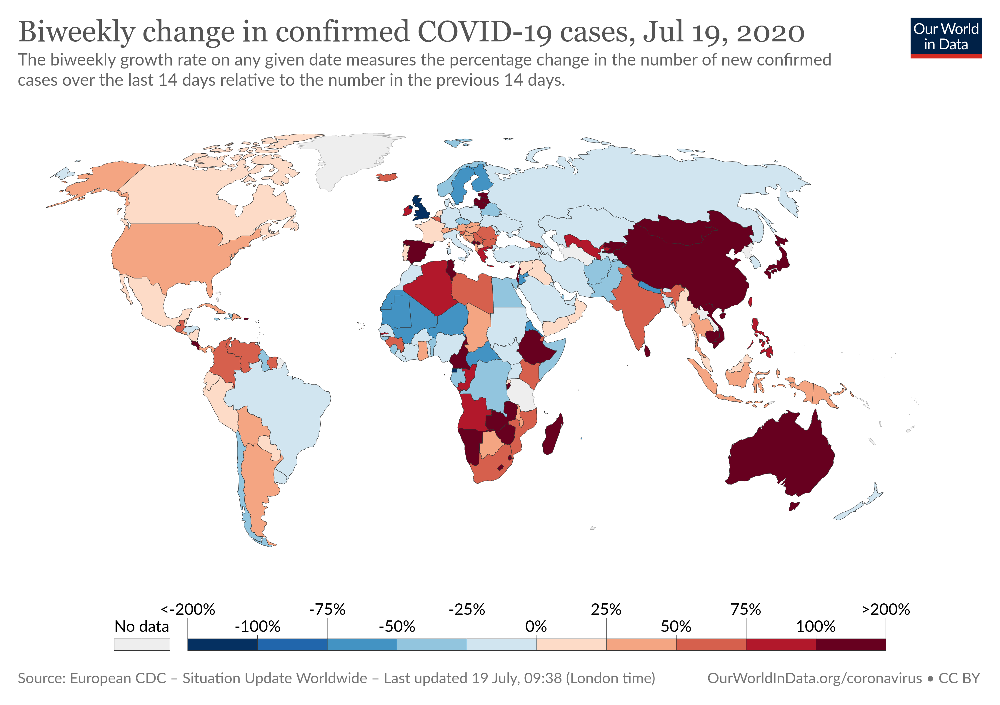

```{r setup, include=FALSE}
options(
  htmltools.dir.version = FALSE
)

knitr::opts_chunk$set(
  echo = FALSE,
  warning = FALSE,
  message = FALSE
)

library(tidyverse)
library(patchwork)
library(palmerpenguins)
library(ggforce)
library(caret)
library(ggalluvial)
library(tidyquant)
library(ggpmisc)
library(latex2exp)

ecdc <- readRDS("datos/2020-07-13_ecdc.rds") %>% 
  filter(cases >= 0 & deaths >= 0)
ejec_presup <- readRDS("datos/covid19-ejecucion-presupuestal/ejec-presup.rds")
dist_epp <- readRDS("datos/covid19-dist-epp/dist-epp.rds")
```

# Datos

## Usamos datos para:

- Responder preguntas concretas
- Explorar relaciones entre variables
- Descubrir patrones
- Tomar decisiones
- Automatizar procesos
- Validar observaciones y experimentos
- Contar una historia


## Datos masivos ("Big Data")

- Retos en el manejo de cantidades ingentes de datos
- Características:
	- Volúmen (cantidad de datos generados y/o almacenados)
	- Velocidad (frecuencia con que renuevan/aparecen)
	- Variedad (multiplicidad de fuentes y formatos)
	- Variabilidad (inconsistencias o cambios en el tiempo)
	- Veracidad (calidad de los datos)

## Datos masivos: LHC

- LHC (Large Hadron Collider)
	- 150 millones de sensores, generando datos 40 millones de veces por segundo.
	- 600 millones de colisiones por segundo
		- Se filtra ~99.99995% ⇒ se graban solo 1,000 colisiones de interés por segundo
	- El volumen anual es de 25 petabytes antes de replicación, y 200 petabytes después de replicar.
	- Sin filtrar se excedería los **500 exabytes por día**.

- *Como referencia*:
  - 1 exabyte = 1,000 petabytes = 1'000,000 terabytes = 1,000'000,000 gigabytes = $10^{18}$ bytes

## Datos masivos: Redes sociales

- Facebook tiene más de 50,000 millones de fotos, con más de 2,000 millones de usuarios activos
- En Twitter: en promedio unos 6,000 tweets por segundo (~ 500 millones al día)
- Instagram: más de 70 millones de fotos por día, más de 800 millones de usuarios activos
- YouTube: más de 2,000 millones de usuarios, 500 horas de video subidas cada minuto (~720,000 horas al día = 82.2 años de videos por día)


## Ciencia de datos

> All models are wrong, but some are useful
> <br/><br/>
> <cite>-- George Box</cite>

[Todos los modelos son incorrectos, pero algunos son útiles]

## Ciencia de datos

- Un campo interdisciplinario que trata de extraer conocimiento o ideas nuevas de los datos.
- Los datos pueden
  - Provenir de múltiples fuentes
  - Tener diversos niveles de calidad
  - Ser completos o parciales
  - Estar estructurados o no estructurados, etc.

## Qué se necesita conocer

- Manipulación y limpieza de datos
- Bases de datos estructuradas y no estructuradas
- Estadística y matemáticas
- Aprendizaje de máquina (Machine Learning)
- Programación de software
  - Especialmente en lenguajes de análisis de datos (R, Python, Julia, etc.)
- Visualización de datos y comunicación

## El camino de la Ciencia de Datos

<small>
*Fuente*: 
http://nirvacana.com/thoughts/2013/07/08/becoming-a-data-scientist/
</small>

```{r out.width="70%"}
knitr::include_graphics("assets/RoadToDataScientist1.png")
```

## Componentes 

- Fuentes
  - Estructuradas y no estructuradas
  - Fijas, variables o periódicas
- Recopilación
  - Extracción e importación
  - Limpieza de datos
- Exploración
  - Transformación de datos
  - Visualización/Análisis Exploratorio de Datos
  - Modelamiento
- Mostrar resultados
  - Reportes y visualizaciones (interactivas o no)
  - Comparaciones, tendencias, etc.


## Flujo de trabajo en Ciencia de Datos

```{r out.width="80%"}

```

## Ejemplo: Clasificación de Pingüinos de Palmer


- Tres especies: Adelie, Chinstrap y Gentoo
- Datos sobre:
  - Longitud y ancho del pico (en mm)
  - Longitud de la aleta (en mm)
  - Peso corposral (en gr)
  - Sexo (female, male)
  - También: Isla y año del registro

```{r fig.align="right",out.height="15%"}
knitr::include_graphics("assets/logo-palmerpenguin.png")
```

*Fuente*: https://allisonhorst.github.io/palmerpenguins/

## Distribución de especies en los datos

```{r}
penguins_df <- penguins[complete.cases(penguins), ]
ggplot(penguins_df, 
       aes(y = species, group = sex, fill = sex)) +
  geom_bar(position = "stack") +
  labs(
    title = "Distribución de Pingüinos por especie y sexo",
    y = "Especies",
    x = "Frecuencia",
    fill = "Sexo"
  ) +
  theme_classic(16)
```

## Las tres especies de pingüinos

```{r}
ggplot(penguins, 
       aes(x = bill_length_mm, 
           y = flipper_length_mm)) +
  geom_point(aes(color = species, 
                 shape = species), size = 3) +
  scale_color_brewer(type = "qual", 
                     palette = "Dark2") +
  labs(
    title = "Distribución de las especies de pingüinos",
    x = "Largo del pico (mm)",
    y = "Largo de la aleta (mm)",
    color = "Especie:",
    shape = "Especie:"
  ) +
  theme_classic(16)
```

## Un modelo de clasificación

- Separamos aleatoriamente a los datos: 75% para entrenar el modelo, y 25% para probar el modelo.
- Usamos el algoritmo Random Forest, con validación cruzada repetida, por 3 veces
- Usaremos el modelo siguiente:
  - Especie --> f(long. pico, ancho pico, long. aleta, peso)


```{r echo=TRUE, eval=FALSE}
set.seed(13579)
df <- penguins %>% select(species, 3:6)
# entrenamos con 75% de datos, probamos con 25%
index <- createDataPartition(df$species, p=0.75, list=FALSE)
penguins_train <- df[index,]
penguins_test <- df[-index,]
# hacemos validación cruzada, repetida, por 3 veces
ctrl <- trainControl(method="repeatedcv", repeats = 3)
model_rf <- train(x = penguins_train[, 2:5], y = penguins_train$species,
                  method = "rf", preProcess = c("center", "scale"),
                  trControl = ctrl, tuneLength = 20)
# aplicamos el model a los datos de prueba
penguins_test$pred <- predict(model_rf, penguins_test[, 2:5])
```


## Eficiencia del modelo

```{r}
load("datos/modelo-rf-penguins.Rdata")
ggplot(penguins_test, 
       aes(x = bill_length_mm, 
           y = flipper_length_mm)) +
  geom_point(aes(color = species, 
                 shape = species), 
             size = 3, show.legend = FALSE) +
  geom_mark_hull(aes(color = pred, label = species), 
                 show.legend = FALSE) +
  scale_color_brewer(type = "qual", 
                     palette = "Dark2") +
  labs(
    title = "Modelo de clasificación de las especies de pingüinos",
    subtitle = "Usando el grupo de datos de prueba (25% de los datos originales)",
    x = "Largo del pico (mm)",
    y = "Largo de la aleta (mm)",
    color = "Especie:",
    shape = "Especie:"
  ) +
  theme_classic(16)

```


# Visualización


## A tomar en cuenta al visualizar datos

> Graphical excellence consists of complex ideas communicated with clarity, precision and efficiency.
>
> <cite>-- Edward Tufte<cite>

## Características de una visualización

- Mapear datos a aspectos de un gráfico:
  - Posición, forma, tamaño, color, grosor y tipo de líneas

```{r}
knitr::include_graphics("assets/common-aesthetics-1.png")
```

*Fuente*: https://serialmentor.com/dataviz/aesthetic-mapping.html

## Objetivos de la visualización de datos

- Hacer comparaciones
- Mostrar una (posible) causalidad
- Mostrar múltiples piezas de información
- Integrar gráficos y anotaciones para una mejor comprensión
- Educar, informar, hacer cambiar de opinión, etc.

## Visualizar cantidades

```{r}
knitr::include_graphics("assets/amounts-1.png")
```
```{r out.height="60%"}
knitr::include_graphics("assets/amounts_multi-1.png")
```

<small>
*Fuente*: https://serialmentor.com/dataviz/directory-of-visualizations.html
</small>

## Visualizar distribuciones

```{r}
knitr::include_graphics("assets/single-distributions-1.png")
```

```{r out.height="60%"}

```

<small>
*Fuente*: https://serialmentor.com/dataviz/directory-of-visualizations.html
</small>

## Visualizar proporciones

```{r out.height="60%"}
knitr::include_graphics("assets/proportions-1.png")
knitr::include_graphics("assets/proportions-comp-1.png")
knitr::include_graphics("assets/proportions-multi-1.png")
```

<small>
*Fuente*: https://serialmentor.com/dataviz/directory-of-visualizations.html
</small>


## Visualizar relacionex "x-y"

```{r}
knitr::include_graphics("assets/basic-scatter-1.png")
```
```{r out.height="60%"}
knitr::include_graphics("assets/xy-binning-1.png")
```
```{r out.height="60%"}

```
<small>
*Fuente*: https://serialmentor.com/dataviz/directory-of-visualizations.html
</small>


## Visualizar datos geoespaciales

```{r}
knitr::include_graphics("assets/geospatial-1.png")
```

<small>
*Fuente*: https://serialmentor.com/dataviz/directory-of-visualizations.html
</small>


## Visualizar Incertidumbre

```{r out.height="60%"}
knitr::include_graphics("assets/errorbars-1.png")
knitr::include_graphics("assets/confidence-dists-1.png")
knitr::include_graphics("assets/confidence-bands-1.png")
```

<small>
*Fuente*: https://serialmentor.com/dataviz/directory-of-visualizations.html
</small>


## Gráficos de sector circular ("pie charts")

En general, no son recomendables, a menos que se tengan pocos valores, y un tabla es mas simple


<table style="border: none;">
<tr>
<td style="vertical-align: top;">
```{r}
sum_df <- penguins_df %>% 
  group_by(species) %>% 
  tally() %>% 
  arrange(desc(species)) %>% 
  mutate(
    prop = 100 * n / sum(n),
    label = paste0(species, "\n", n, sprintf(" (%.1f%%)", prop))
  )

ggplot(sum_df, aes(x = "", y = n, fill = species)) +
  geom_col(width = 1, show.legend = FALSE) +
  geom_text(aes(label = label),
            position = position_stack(vjust = 0.5),
            color = "white", size = 6) +
  scale_color_brewer(palette = "Dark2", type = "qual") +
  coord_polar("y", start = 0) +
  labs(
    x = "",
    y = "",
    title = "Especies de pingüinos"
  ) +
  theme_void(16)
```
</td>
<td style="vertical-align: top;">

```{r}
knitr::kable(
  sum_df %>% select(-label) %>% arrange(desc(species)),
  col.names = c("Especie", "Cantidad", "Porcentaje"),
  digits = 1, 
  caption = "Especies de pingüinos"
)
```
</td>
</tr>
</table>

## El "Cuarteto de Anscombe"

```{r}
# aes para dibujar las ecuaciones en los gráficos
fm_aes <- aes(label =  paste(stat(eq.label), "*\", con: \"*",
                             stat(adj.rr.label), "*\"\"",
                             sep = ""))


a1 <- anscombe[,c(1,5)] %>% as_tibble()
a2 <- anscombe[,c(2,6)] %>% as_tibble()
a3 <- anscombe[,c(3,7)] %>% as_tibble()
a4 <- anscombe[,c(4,8)] %>% as_tibble()
```

<div class="fragment fade-left" data-fragment="1">

```{r}
knitr::kable(t(a1), caption = "Grupo #1", digits = 2)
```

</div>
<div class="fragment fade-left" data-fragment="2">

```{r}
knitr::kable(t(a2), caption = "Grupo #2", digits = 2)
```

</div>
<div class="fragment fade-left" data-fragment="3">

```{r}
knitr::kable(t(a3), caption = "Grupo #3", digits = 2)
```

</div>
<div class="fragment fade-left" data-fragment="4">

```{r}
knitr::kable(t(a4), caption = "Grupo #4", digits = 2)
```

</div>

## Las tendencias parecen ser iguales

```{r out.height="80%"}
theme_set(theme_classic())
p1 <- ggplot(a1, aes(x = x1, y = y1)) +
  stat_smooth(method = "lm", se = FALSE, formula = y ~ x) +
  stat_poly_eq(fm_aes,
               formula = y ~ x, parse = TRUE,
               label.x = "left", label.y = "top") +
  ggtitle("Grupo #1")

p2 <- ggplot(a2, aes(x = x2, y = y2)) +
  stat_smooth(method = "lm", se = FALSE, formula = y ~ x) +
  stat_poly_eq(fm_aes,
               formula = y ~ x, parse = TRUE,
               label.x = "left", label.y = "top") +
  ggtitle("Grupo #2") 

p3 <- ggplot(a3, aes(x = x3, y = y3)) +
  stat_smooth(method = "lm", se = FALSE, formula = y ~ x) +
  stat_poly_eq(fm_aes,
               formula = y ~ x, parse = TRUE,
               label.x = "left", label.y = "top") +
  ggtitle("Grupo #3") 

p4 <- ggplot(a4, aes(x = x4, y = y4)) +
  stat_smooth(method = "lm", se = FALSE, formula = y ~ x) +
  stat_poly_eq(fm_aes,
               formula = y ~ x, parse = TRUE,
               label.x = "left", label.y = "top") +
  ggtitle("Grupo #4") 

(p1 + p2) / (p3 + p4)
```

## Pero en realidad, no lo son

Mostrar los datos es importante

```{r out.height="80%"}
p1 <- ggplot(a1, aes(x = x1, y = y1)) +
  geom_point(size = 2, color = "red") +
  stat_smooth(method = "lm", se = TRUE, formula = y ~ x) +
  stat_poly_eq(fm_aes,
               formula = y ~ x, parse = TRUE,
               label.x = "left", label.y = "top") +
  ggtitle("Grupo #1") 

p2 <- ggplot(a2, aes(x = x2, y = y2)) +
  geom_point(size = 2, color = "red") +
  stat_smooth(method = "lm", se = TRUE, formula = y ~ x) +
  stat_poly_eq(fm_aes,
               formula = y ~ x, parse = TRUE,
               label.x = "left", label.y = "top") +
  ggtitle("Grupo #2")

p3 <- ggplot(a3, aes(x = x3, y = y3)) +
  geom_point(size = 2, color = "red") +
  stat_smooth(method = "lm", se = TRUE, formula = y ~ x) +
  stat_poly_eq(fm_aes,
               formula = y ~ x, parse = TRUE,
               label.x = "left", label.y = "top") +
  ggtitle("Grupo #3") 

p4 <- ggplot(a4, aes(x = x4, y = y4)) +
  geom_point(size = 2, color = "red") +
  stat_smooth(method = "lm", se = TRUE, formula = y ~ x) +
  stat_poly_eq(fm_aes,
               formula = y ~ x, parse = TRUE,
               label.x = "left", label.y = "top") +
  ggtitle("Grupo #4") 


(p1 + p2) / (p3 + p4)

```

## No abusemos de la regresión lineal


*Fuente*: https://xkcd.com/1725/ ("Linear regression")


## Y tengamos cuidado con correlaciones sin sentido

```{r}

```

*Fuente*: http://tylervigen.com/spurious-correlations

# Ejemplos de visualizaciones

Algunas buenas, otras ...

## Lo bueno, lo malo, lo feo y lo errado

```{r}
knitr::include_graphics("assets/ugly-bad-wrong-examples-1.png")
```

<small>
*Fuente*: https://serialmentor.com/dataviz/introduction.html
</small>


## Un "pie chart" ininteligible 👎



<small>
Fuente: http://livingqlikview.com/the-9-worst-data-visualizations-ever-created/
</small>

## Y otro mas que no suma 100% 👎


<small>
Fuente: http://livingqlikview.com/the-9-worst-data-visualizations-ever-created/
</small>

## Usar 3D en forma innecesaria 👎


```{r}
knitr::include_graphics("assets/ch-01-chartjunk-life-expectancy.png")
```

*Fuente*: https://socviz.co/


## Evolución de casos COVID-19 en Brasil 👍



<small>
*Fuente*: https://twitter.com/ArthurWelle/status/1284636341297393665
</small>


## Casos acumulados para países 👍

```{r out.height="50%"}

```

*Fuente*: https://ourworldindata.org/coronavirus

## Y trayectoria diaria en Latinoamérica 👍

```{r out.height="50%"}

```

*Fuente*: https://ourworldindata.org/coronavirus

## El cambio en casos en las últimas dos semanas 👍


```{r out.height="50%"}

```

*Fuente*: https://ourworldindata.org/coronavirus


## Casos positivos COVID-19 (Fuente: ECDC)

```{r}
df1 <- ecdc %>%
  mutate(
    cases_per1m = cases * 1E6 / pop2019,
    deaths_per1m = deaths * 1E6 / pop2019,
    cases_acc_per1m = cases_acc * 1E6 / pop2019,
    deaths_acc_per1m = deaths_acc * 1E6 / pop2019
  ) 

ggplot(df1, aes(x = dateRep, 
                y = cases,
               group = country,
               color = country)) +
  geom_point(show.legend = FALSE) +
  geom_line(show.legend = FALSE) +
  theme_classic(16) 
```

## Mejorando la visualizacion

- Seleccionar algunos países de interés
- Contar dias que tuvieron el caso 100 en adelante
- Usar casos por millón de habitantes

```{r out.width="100%", fig.width=12}
df2 <- df1 %>%
  filter(iso2c %in% c("PE", "US", "MX", "CO", "EC", "BR", "CL"))

ggplot(df2, aes(x = days_since_100cases, 
                y = cases_per1m,
               group = country,
               color = country)) +
  geom_point(size = .5, show.legend = TRUE) +
  geom_line() +
  theme_classic(16)
```

## Mejorando la visualización

- Etiquetando mejor los componentes
- Usar un promedio móvil de 14 días

```{r out.width="100%", fig.width=12}
ggplot(df2, aes(x = days_since_100cases, 
                y = cases_per1m,
               group = country,
               color = country)) +
  geom_point(show.legend = FALSE, size = .5, 
             alpha = .7) +
  geom_ma(n = 14, linetype = "solid", size = 1,
         show.legend = TRUE) +
  theme_classic(16) +
  ylim(0, 200) +
  labs(
    x = "Días desde el caso 100 ",
    y = "",
    color = "País:",
    title = "Casos diarios por millón de personas (con promedio móvil de 14 días)",
    subtitle = "Fuente: ECDC, al 2020-07-13",
    caption = "Nota: No se muestran los datos del 2020-04-27 de Ecuador (664 casos por millón de habitantes)\nni del 2020-06-19 de Chile (1909 casos por millón de habitantes)"
  ) +
  scale_color_viridis_d() +
  theme(
    legend.position = c(.2, .7)
  )
```

## Ejecución presupuestal

```{r fig.width=12, fig.height=7}
# ejecución presupuestal
reg <- ejec_presup %>%
  filter(tipo_gobierno == "R") %>% 
  rename(
    dpto = departamento_ejecutora_nombre
  ) %>% 
  mutate(
    dpto = as.character(dpto),
    dpto = if_else(
      str_detect(dpto, "CALLAO"),
      "CALLAO",
      dpto
    )
  )

reg_sum <- reg %>%
  filter(mes_eje != 0) %>%
  group_by(dpto, mes) %>%
  summarise(
    certificado = sum(monto_certificado, na.rm = T),
    comprometido = sum(monto_comprometido, na.rm = T),
    devengado = sum(monto_devengado, na.rm = T),
    girado = sum(monto_girado, na.rm = T)
  ) %>% 
  pivot_longer(
    cols = c(certificado, comprometido, devengado, girado),
    names_to = "estado",
    values_to = "monto"
  ) %>% 
  mutate(
    estado = str_to_title(estado)
  )

ggplot(reg_sum,
       aes(x = mes, y = monto/1e6,
           fill = estado)) +
  geom_col(position = "dodge") +
  labs(
    title = "Ejecución del presupuesto COVID-19 por Departamento",
    subtitle = "Fuente: MEF, Datos Abiertos (al 2020-07-14)",
    x = "Mes",
    y = "Monto (en millones de soles)",
    fill = "Estado del monto: "
  ) +
  theme_linedraw(14) +
  theme(
    legend.position = "bottom"
  ) +
  facet_wrap(~dpto, nrow = 5)
```

## Veamos en mas detalle a San Martín, La Libertad, Callao y Piura

```{r}
reg_sum2 <- reg_sum %>% 
  filter(dpto %in% c("SAN MARTIN", "LA LIBERTAD", "CALLAO", "PIURA"))

ggplot(reg_sum2,
       aes(x = mes, y = monto/1e6,
           fill = estado)) +
  geom_col(position = "dodge") +
  labs(
    title = "Ejecución del presupuesto COVID-19",
    subtitle = "Fuente: MEF, Datos Abiertos (al 2020-07-14)",
    x = "Mes",
    y = "Monto (en millones de soles)",
    fill = "Estado del monto: "
  ) +
  theme_linedraw(14) +
  theme(
    legend.position = "bottom"
  ) +
  facet_wrap(~dpto, nrow = 2)

```

## Equipo de protección personal COVID-19

```{r}
epp_df <- dist_epp %>% 
  select(fecha, tipo, cantidad) %>% 
  mutate(
    mes = month(fecha, label = TRUE, 
                locale = "es_PE.utf8"),
    tipo_simple = case_when(
      tipo %in% c("CALZADO", "PAPEL", "DESINFECTANTE", "LIMPIEZA", "ROPA") ~ "OTROS",
      tipo %in% c("CARETA", "MASCARILLA/RESPIRADOR") ~ "PROTECCION DE ROSTRO",
      TRUE ~ tipo
    ) %>% 
      str_replace("PROTECCIÓN DE", "PROT.") %>% 
      str_replace("PROTECCIÓN", "PROT.") %>%
      str_replace("PROTECCION DE", "PROT.")
  ) %>% 
  group_by(mes, tipo_simple) %>% 
  summarise(
    total = sum(cantidad, na.rm = TRUE)
  )

ggplot(epp_df,
       aes(y = total/1e6, axis1 = mes, 
           axis2 = tipo_simple)) +
  geom_alluvium(aes(fill = mes), width = 1/12,
                show.legend = FALSE) +
  geom_stratum(width = 1/6, fill = "black", color = "grey") +
  geom_label(stat = "stratum", aes(label = after_stat(stratum))) +
  scale_y_continuous(
    labels = scales::comma,
    breaks = seq(0, 60, by = 5)
  ) +
  scale_fill_brewer(palette = "Dark2", type = "qual") +
  labs(
    x = "",
    y = "Cantidades de items (millones de unidades)",
    title = "Distribución de material (COVID-19)",
    subtitle = "Fuente: MINSA, Datos Abiertos (al 2020-07-13)"
  ) +
  theme_minimal(14) +
  theme(
    axis.text.x = element_blank(),
    panel.grid = element_blank()
  )

```

# Para finalizar


## En Resúmen

- Datos: es la base de todo, conseguirlos no siempre es fácil, y hay que tener cuidado con que fuentes se usan, y revisarlos por calidad, consistencia, etc.
- Visualizar los datos: es crítico para poder entender el problema que tratamos de resolver, y para decidir si podemos o no hacer con la información a mano.
- Hay que tener siempre presente lo que se quiere comunicar, y a que nivel de detalle.
- La visualización no debería tener elementos que no contribuyen al mensaje.
- Usen buenas herramientas para obtener buenos resultados.

## Libros, tutoriales y misc.

- [Data Organization in Spreadsheets](https://amstat.tandfonline.com/doi/full/10.1080/00031305.2017.1375989#.XYlLQOZKiPQ), K. W. Broman y K. H. Woo, *The American Statistician*.
- [Fundamentals of Data Visualization](https://serialmentor.com/dataviz/), C. O. Wilke
- [Data Visualization with R](https://rkabacoff.github.io/datavis/), R. Kabacoff
- [Data Visualization - A practical introduction](https://socviz.co/), K. Healy
- [The Data Visualization Catalogue](https://datavizcatalogue.com/)
- [R for Data Science (R4DS)](https://r4ds.had.co.nz), G. Grolemund y H. Wickham
  - [Versión en Español](https://es.r4ds.hadley.nz/)
- [TidyTuesday](https://github.com/rfordatascience/tidytuesday): Datos y ejemplos de visualizaciones
- [Dataviz Books Everyone Should Read](https://informationisbeautiful.net/visualizations/dataviz-books/)


## Gracias 

- URL de esta presentación:
  - https://castagnetto.site/talks/upch/webinar-viz-covid19.html

- Código y datos de esta presentación:
  - https://github.com/jmcastagnetto/jmc_talks/tree/master/20200720-webinar-inginf-upch/

- Contacto:
  - Twitter: @jmcastagnetto
  - Email: jesus@castagnetto.com
