::: {.cell}

:::


# Datos

## Usamos datos para

::: {.incremental}

- Responder preguntas concretas
- Explorar relaciones entre variables
- Descubrir patrones
- Automatizar procesos
- Validar observaciones y experimentos
- Contar una historia
- Tomar decisiones

:::

## Ciencia de datos

- Un campo interdisciplinario que trata de extraer conocimiento o ideas nuevas de los datos.
- Los datos pueden
  - Provenir de múltiples fuentes
  - Tener diversos niveles de calidad
  - Ser completos o parciales
  - Estar estructurados o no estructurados, etc.

## Qué se necesita conocer

::: {.incremental}

- Manipulación, limpieza y transformación de datos
- Bases de datos estructuradas y no estructuradas
- Estadística y matemáticas
- Aprendizaje de máquina (Machine Learning)
- Programación de software
  - Especialmente en lenguajes de análisis de datos (R, Python, Julia, etc.)
- Visualización de datos y comunicación

:::

## Flujo de trabajo en Ciencia de Datos


## Ciencia de datos: Modelamiento


::: {.quote}

<blockquote>
All models are wrong, but some are useful
<cite>George Box</cite>
</blockquote>

:::

[*Todos los modelos son incorrectos, pero algunos son útiles*]

## Los Pingüinos de Palmer

:::: {.columns}

::: {.column width="70%"}

- Tres especies: Adelie, Chinstrap y Gentoo
- Variables:
  - Longitud y ancho del pico (en mm)
  - Longitud de la aleta (en mm)
  - Peso corporal (en gr)
  - Sexo (female, male)
  - También: Isla y año del registro

:::

::: {.column width="30%"}


:::

::::

## Distribución por especie y sexo


::: {.cell}
::: {.cell-output-display}
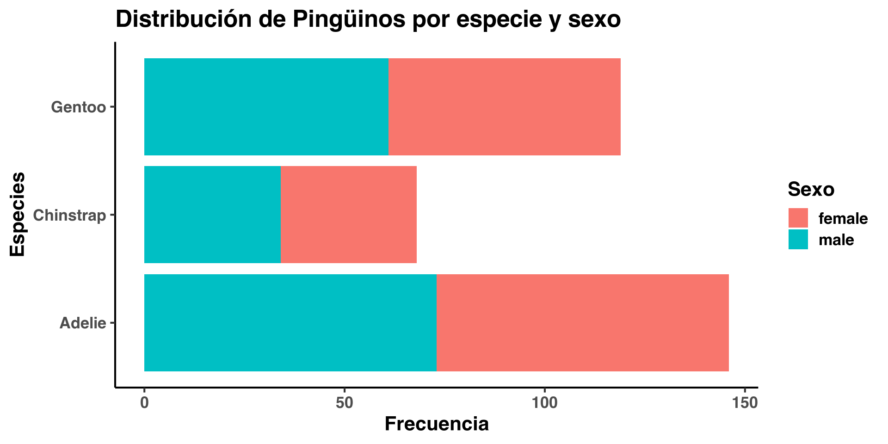{width=960}
:::
:::


## Las tres especies de pingüinos


::: {.cell}
::: {.cell-output-display}
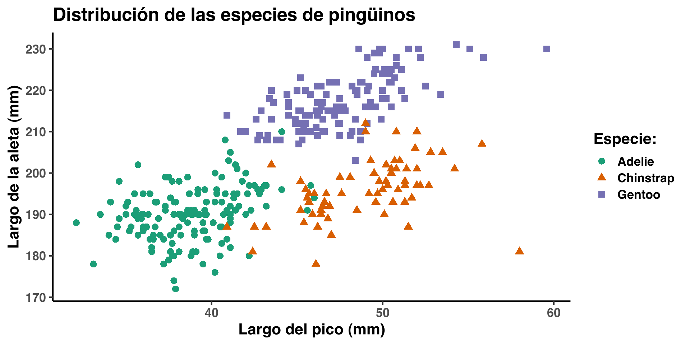{width=960}
:::
:::


## Un modelo de clasificación

- Separamos aleatoriamente a los datos: 75% para entrenar el modelo y 25% para probar el modelo.
- Usamos el algoritmo "Random Forest", con validación cruzada repetida, por 3 veces
- Usaremos el modelo siguiente:
  - *Especie* = f(long. pico, ancho pico, long. aleta, peso)

## Código del modelo de clasificación (en R)


::: {.cell}

```{.r .cell-code}
set.seed(13579)
df <- penguins %>% select(species, 3:6)
# entrenamos con 75% de datos, probamos con 25%
index <- createDataPartition(df$species, p=0.75, list=FALSE)
penguins_train <- df[index,]
penguins_test <- df[-index,]
# hacemos validación cruzada, repetida, por 3 veces
ctrl <- trainControl(method="repeatedcv", repeats = 3)
model_rf <- train(x = penguins_train[, 2:5], y = penguins_train$species,
                  method = "rf", preProcess = c("center", "scale"),
                  trControl = ctrl, tuneLength = 20)
# aplicamos el modelo a los datos de prueba
penguins_test$pred <- predict(model_rf, penguins_test[, 2:5])
```
:::


## Evaluación visual del modelo


::: {.cell}
::: {.cell-output-display}
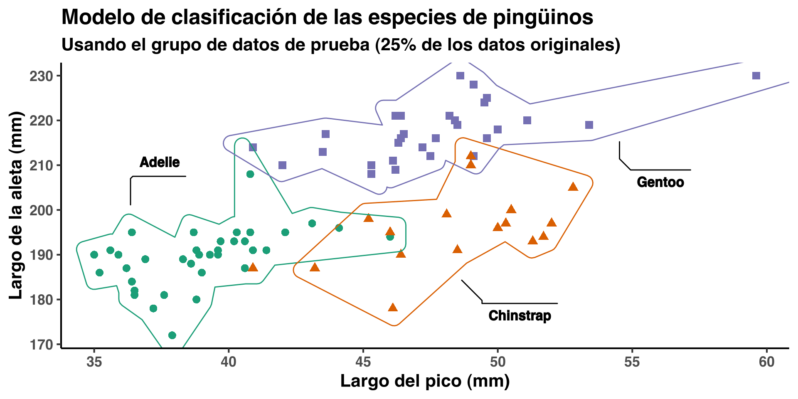{width=960}
:::
:::


# Visualización


## A tomar en cuenta al visualizar datos

::: {.quote}

<blockquote>
Graphical excellence consists of complex ideas communicated with
clarity, precision and efficiency.
<cite>Edward Tufte</cite>
</blockquote>

:::

## Características de una visualización

- Mapear datos a los aspectos de un gráfico: Posición, forma, tamaño, color, grosor y tipo de líneas


## Objetivos de la visualización de datos

::: {.incremental}

- Hacer comparaciones
- Mostrar una (posible) causalidad
- Mostrar múltiples piezas de información
- Integrar gráficos y anotaciones para una mejor comprensión
- Educar, informar, hacer cambiar de opinión, etc.

:::

## Graficar cantidades

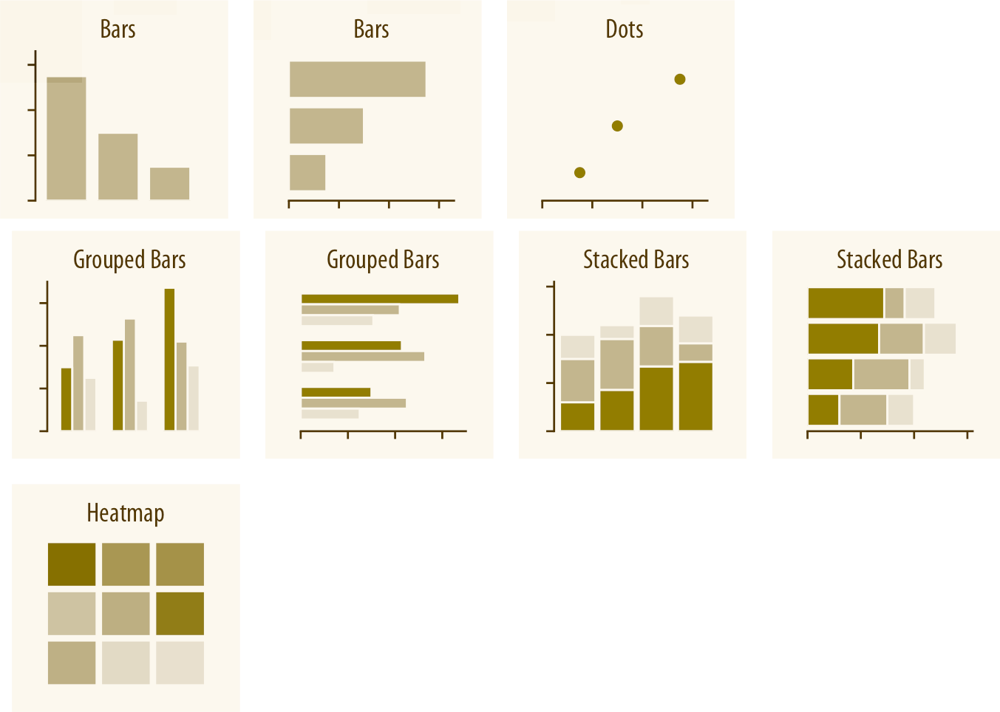{height=5in}

## Graficar distribuciones

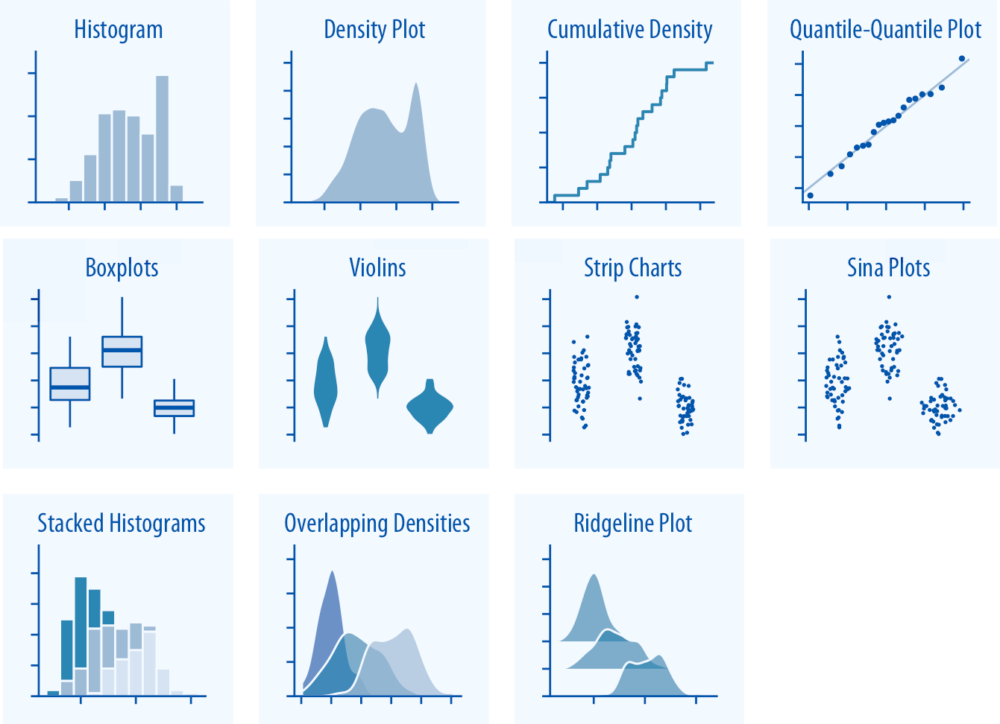{height=5in}

## Graficar proporciones

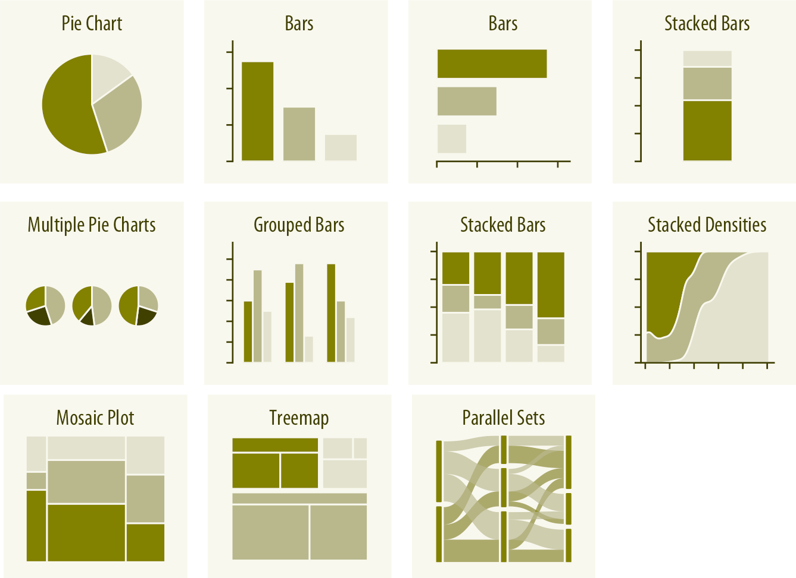{height=5in}

## Graficar relaciones "x-y"

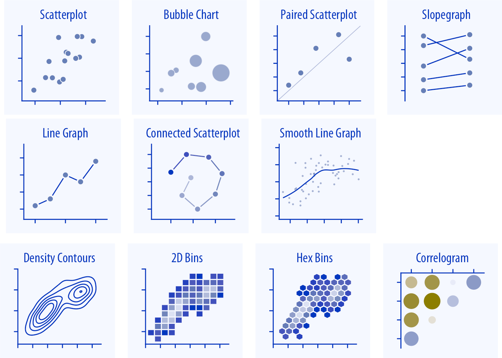{height=5in}

## Graficar datos geoespaciales


## Graficar Incertidumbre

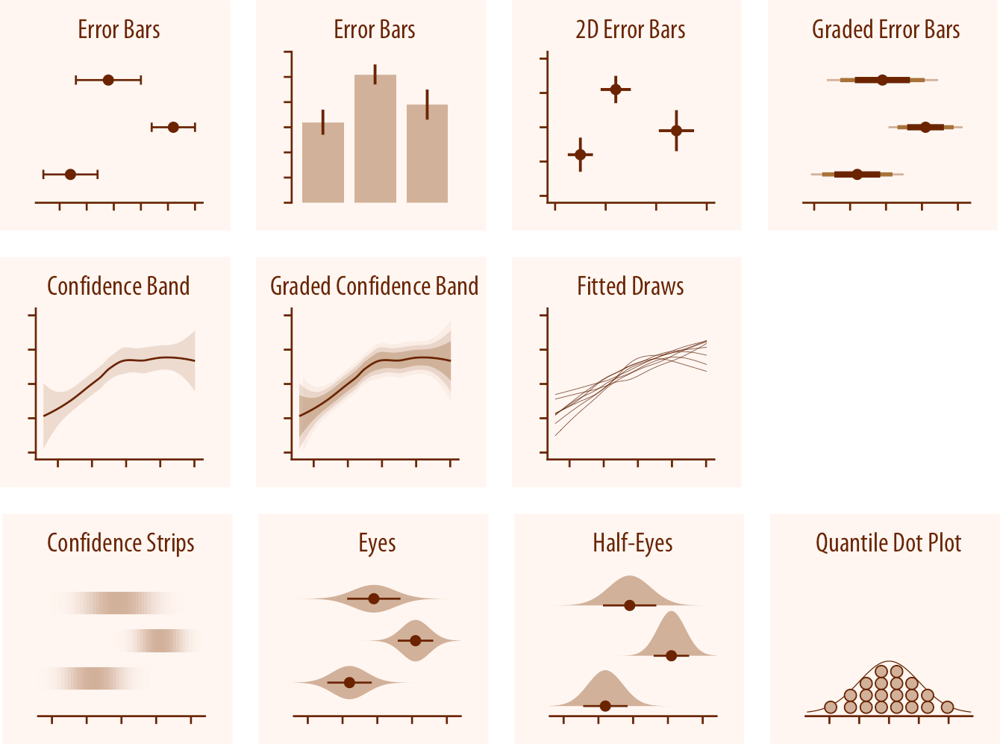{height=5in}

## Gráficos de sector circular ("pie charts")

En general, no son recomendables, a menos que se tengan pocos valores y,
aún en ese caso, una tabla es mucho mas simple

:::: {.columns}

::: {.column width=40%}


::: {.cell}
::: {.cell-output-display}
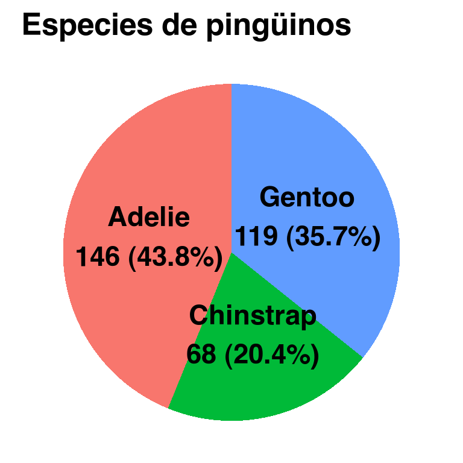{width=384}
:::
:::


:::

::: {.column width=60%}


::: {.cell}
::: {.cell-output-display}
Table: Especies de pingüinos

|Especie   | Cantidad| Porcentaje|
|:---------|--------:|----------:|
|Gentoo    |      119|       35.7|
|Chinstrap |       68|       20.4|
|Adelie    |      146|       43.8|
:::
:::


:::

::::

## El "Cuarteto de Anscombe" {.smaller}


::: {.cell}
::: {.cell-output-display}
|   | x1|    y1| x2|   y2| x3|    y3| x4|    y4|
|:--|--:|-----:|--:|----:|--:|-----:|--:|-----:|
|1  | 10|  8.04| 10| 9.14| 10|  7.46|  8|  6.58|
|2  |  8|  6.95|  8| 8.14|  8|  6.77|  8|  5.76|
|3  | 13|  7.58| 13| 8.74| 13| 12.74|  8|  7.71|
|4  |  9|  8.81|  9| 8.77|  9|  7.11|  8|  8.84|
|5  | 11|  8.33| 11| 9.26| 11|  7.81|  8|  8.47|
|6  | 14|  9.96| 14| 8.10| 14|  8.84|  8|  7.04|
|7  |  6|  7.24|  6| 6.13|  6|  6.08|  8|  5.25|
|8  |  4|  4.26|  4| 3.10|  4|  5.39| 19| 12.50|
|9  | 12| 10.84| 12| 9.13| 12|  8.15|  8|  5.56|
|10 |  7|  4.82|  7| 7.26|  7|  6.42|  8|  7.91|
|11 |  5|  5.68|  5| 4.74|  5|  5.73|  8|  6.89|
:::
:::


## Las tendencias parecen ser iguales


::: {.cell}
::: {.cell-output-display}
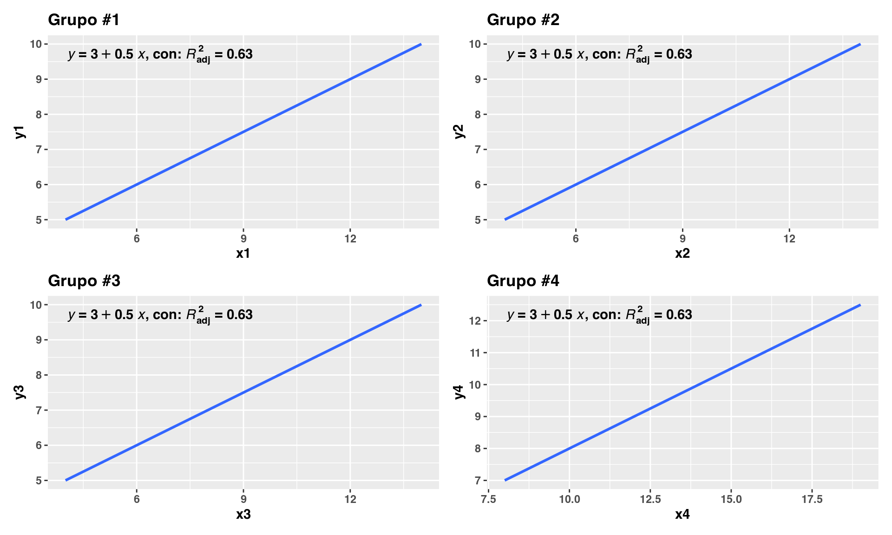{width=960}
:::
:::


## Pero en realidad, no lo son


::: {.cell}
::: {.cell-output-display}
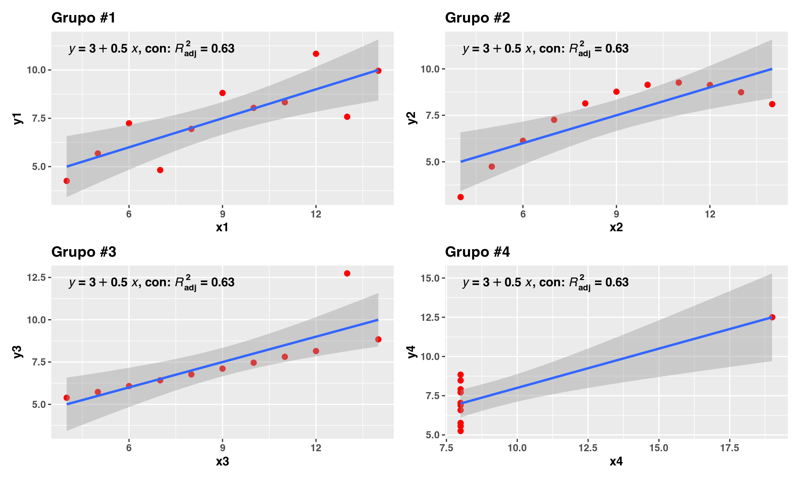{width=960}
:::
:::


## No abusemos de la regresión lineal

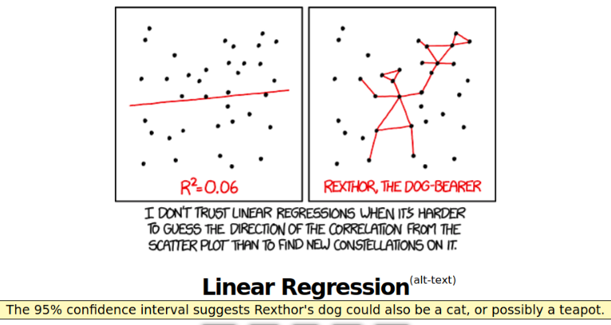

## Y cuidado con correlaciones sin sentido

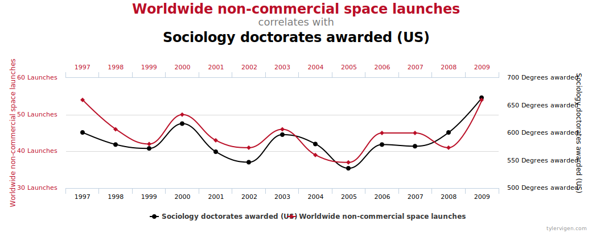

# Ejemplos de visualizaciones

Algunas buenas, otras ...

## Lo bueno, lo malo, lo feo y lo errado

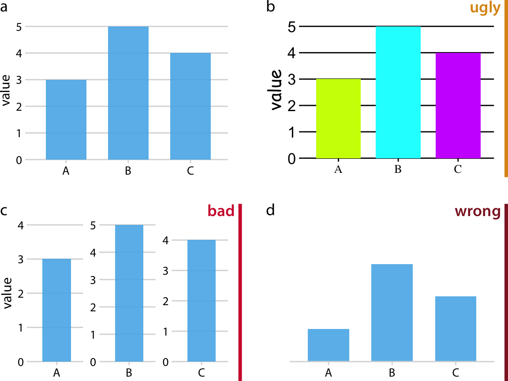

## Un "pie chart" ininteligible 👎


## Y otro más que no suma 100% 👎


## Usar 3D en forma innecesaria 👎


## Interconección por cables submarinos 👍


<video data-autoplay style="margin-left: auto; margin-right: auto; display: block" src="assets/tyler-cable-viz.mp4" height="500"></video>

<small>
*Fuente*: [Tyler Morgan-Wall, @tylermorganwall](https://twitter.com/tylermorganwall/status/1440669533157556227?s=20 
)
</small>

## Pista de Mario Kart 👍

<video data-autoplay style="margin-left: auto; margin-right: auto; display: block" src="assets/cedric-making-of-mario-chart.mp4" height="500"></video>

<small>
*Fuente*: [Cédric Scherer, @CedScherer](https://twitter.com/CedScherer/status/1398677194596044803?s=20)
</small>


## Mapa de relieve del Perú 👍

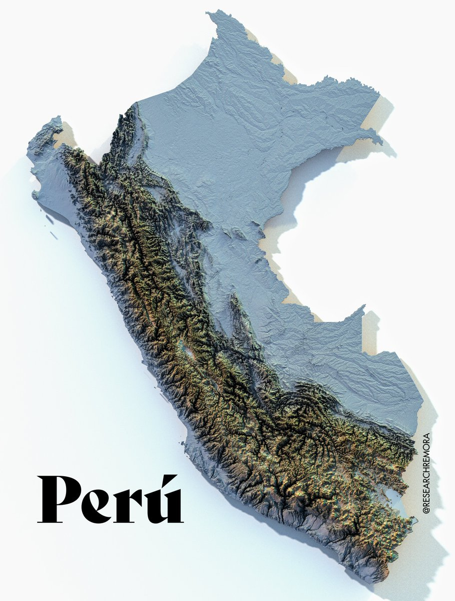

## Densidad poblacional en Perú 👍

{height=5in}


## Evolución de casos COVID-19 en Brasil 👍

{height=5in}

## Avance de vacunación COVID-19 👍

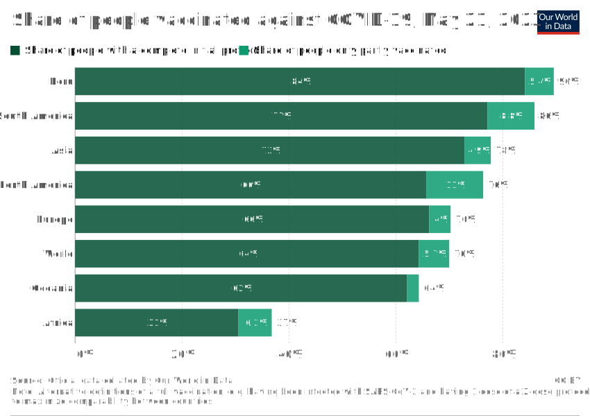{height=5in}

## Efecto de la sequía en Kenya 👍


## Personas desplazadas por la guerra en Ucrania 👍

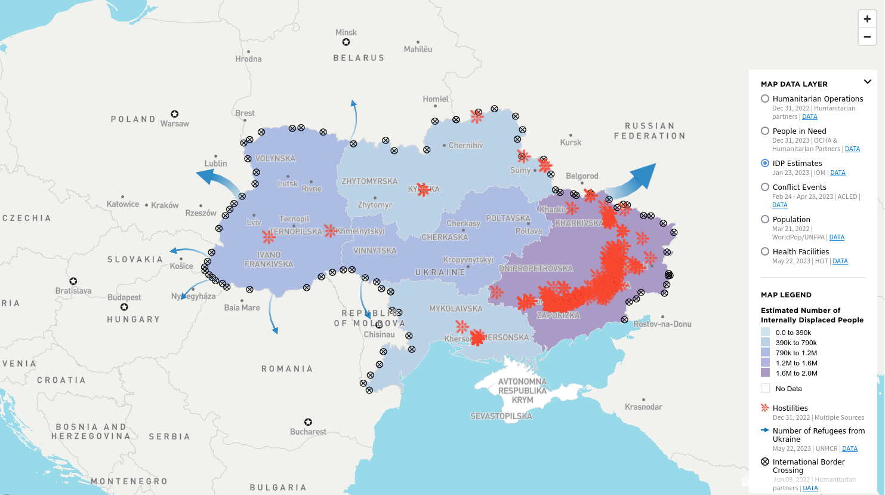{height=4.5in}

# Para finalizar

## Resumen {.smaller}

::: {.incremental}

- **Datos**: son la base de todo, conseguirlos no siempre es fácil y hay que tener cuidado con qué fuentes se usan y revisarlos por calidad, consistencia, etc.
  - El manejo, proceso, limpieza y estandarización de datos es crucial para el análisis, visualización, modelamiento, etc. que querramos hacer.
- **Visualizar los datos**: es crítico para poder entender el problema que tratamos de resolver y para decidir si podemos o no solucionarlo con la información disponible.
  - Hay que tener siempre presente lo que se quiere comunicar y a qué nivel de detalle.
  - La visualización no debería tener elementos que no contribuyen al mensaje.
- Usen buenas herramientas para obtener buenos resultados. Busquen **reproducibilidad** y **replicabilidad** tanto en el proceso de datos, como en la vizualización, análisis y modelamiento: aprendan a usar código para esas actividades y a documentar adecuadamente.

:::

##

- URL de esta presentación: https://castagnetto.site/talks/20230601-webinar-dataviz-upch/index.html
- Código, datos y gráficos de esta presentación: https://github.com/jmcastagnetto/jmc_talks/tree/master/20230601-webinar-dataviz-upch/
- Contacto: Jesus M. Castagnetto, Ph.D.
  - Twitter: https://twitter.com/jmcastagnetto
  - Mastodon: https://mastodon.org/@jmcastagnetto
  - Github: https://github.com/jmcastagnetto
